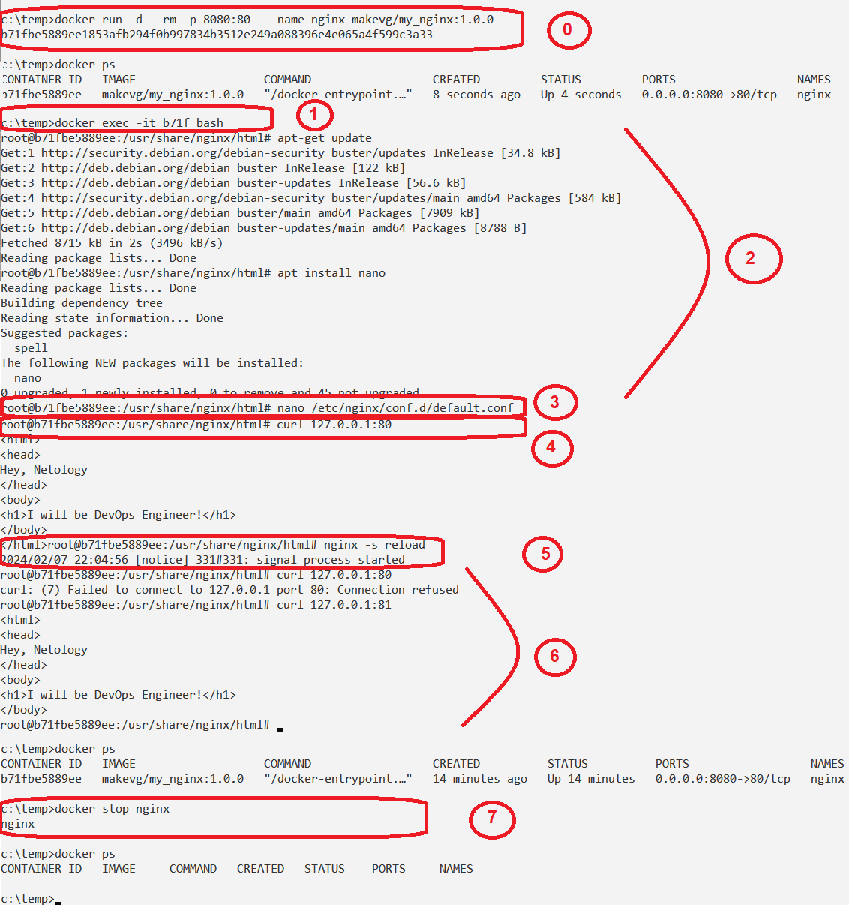
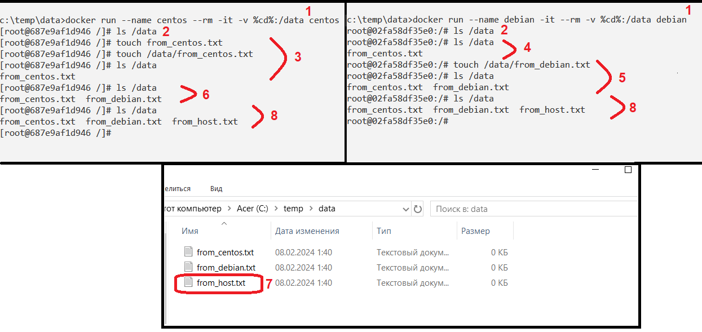

# Оркестрация группой Docker контейнеров на примере Docker Compose

## Задача 1 - создание собственного образа

Создан образ на основе Nginx версии 1.21.1 - [makevg/my_nginx](https://hub.docker.com/repository/docker/makevg/my_nginx/general).
В нем изменена главная страница.


## Задача 2 - запуск контейнера
Команда создания и запуска контейнера с именем _nginx_ из образа, сделанного в задаче 1.
```
docker run -d --rm -p 8080:80  --name nginx makevg/my_nginx:1.0.0
```

Параметры контейнера:
- имя - _nginx_
- проброс 80 порта контейнера на порт 8080 хоста
- запуск в фоновом режиме (`-d`)
- удаление контейнера после остановка (`--rm`)


## Задача 3 - выполнение команд внутри контейнера
1. Открытые консоли внутри контейнера
   ```
   docker exec -it nginx bash
   ```

2. Установка текстового редактора
   ```
   apt-get update
   apt-get install nano
   ```
3. Редактирвоание файла `/etc/nginx/conf.d/default.conf` - изменение порта с 80 на 81
   ```
   nano /etc/nginx/conf.d/default.conf
   ```
4. Проверка работы web-сервера на 80-м порту - ответ есть
   ```
   curl 127.0.0.1:80
   ```
5. Перезапуск службы
   ```
   nginx -s reload
   ```
6. Проверка работы web-сервера на 80-м порту - ответа нет (а на 81-м - есть)
   ```
   curl 127.0.0.1:80
   curl 127.0.0.1:81  
   ```
7. Остановка и автоматическое удаление контейнера
   ```
   docker stop nginx
   ```

Картинка:


## Задача 4 - использование внешней папки
1. Создание двух контейнеров: centos и debian с монтированной папкой `/data`
   ```
   docker run --name centos --rm -it -v %cd%:/data centos
   docker run --name debian --rm -it -v %cd%:/data debian
   ```

2. Проверка содержимого папки в обоих контейнерах
   ```
   ls /data
   ```
3. Создание файла `from_centos.txt` в контейнере centos
   ```
   touch /data/from_centos.txt
   ls /data
   ```
4. Проверка содержимого папки в контейнере debian
   ```
   ls /data
   ```
5. Создание файла `from_debian.txt` в контейнере debian
   ```
   touch /data/from_debian.txt
   ls /data
   ```
6. Проверка содержимого папки в контейнере centos
   ```
   ls /data
   ```
7. Создание файла `from_host.txt` в папке на хостовой машине
   ```
   echo "" > from_host.txt
   ```
6. Проверка содержимого папки в обоих контейнерах
   ```
   ls /data
   ```
   
Картинка:


## Задача 5 - использование docker compose
[Docker-compose.yml](Docker-compose.yml)
[my-compose.yml](my-compose.yml)
В этом задании не получается сбросить пароль контейнеру Portainer.


# Задание
[https://github.com/netology-code/virtd-homeworks/tree/shvirtd-1/05-virt-03-docker-intro](https://github.com/netology-code/virtd-homeworks/tree/shvirtd-1/05-virt-03-docker-intro)
