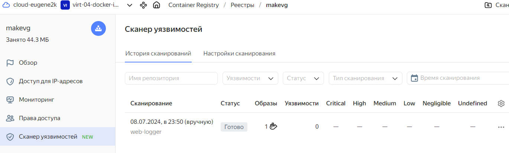
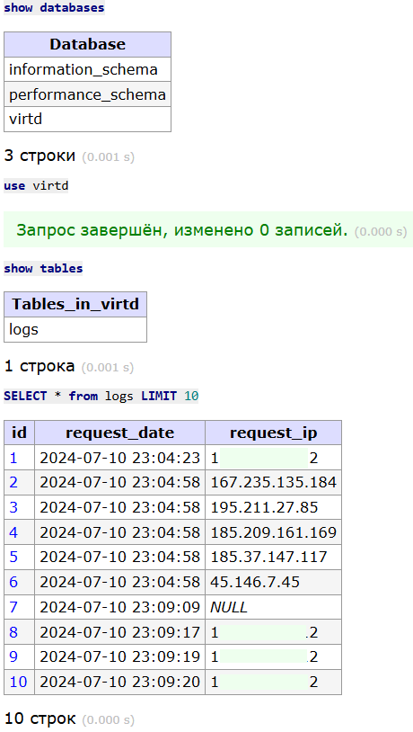
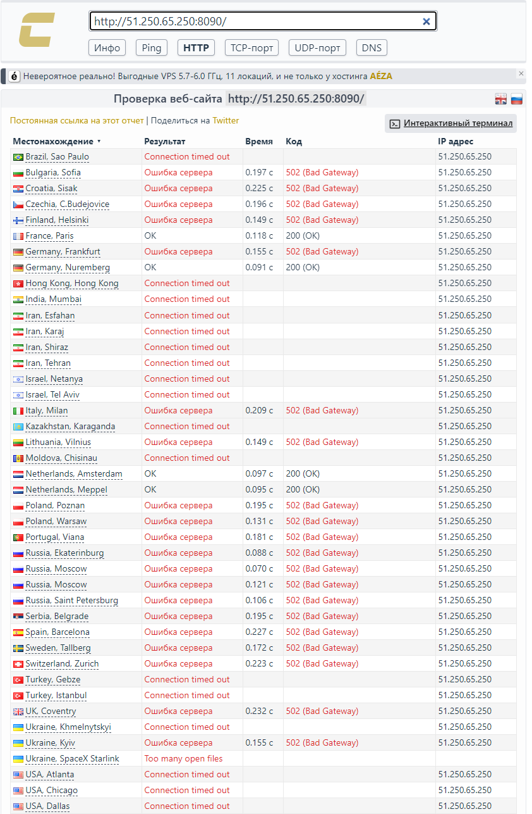
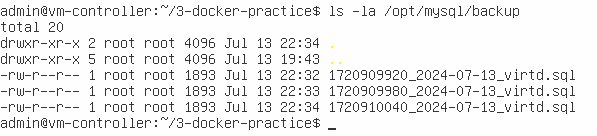
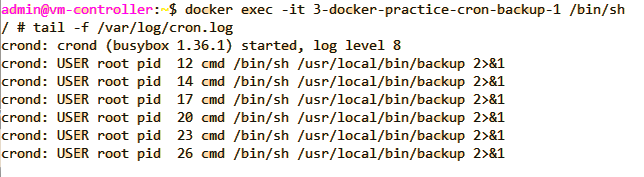

# Практическое применение Docker

## Задача 0 --- версии программ
Версии установленных программ:
docker:
```
$ docker --version
Docker version 24.0.2, build cb74dfc
```

docker compose:
```
$ docker compose version
Docker Compose version v2.28.1
```

## Задача 1 --- web-logger

Репозиторий проекта : [https://github.com/mea2k/devops/tree/main/3-docker-practice](https://github.com/mea2k/devops/tree/main/3-docker-practice)

Сборка проекта включает следующие контейнеры ([compose.yaml](compose.yaml)):
- reverse-proxy (`haproxy`, запускается на порту _8080_)
- ingress-proxy (`nginx`, запускается на порту _8090_)
- web-logger (запускается на порту `APP_PORT` или _5000_)
- mysql (запускается на порту _3306_)
- adminer (запускается на порту _9000_)
- cron-backup (`schnitzler/mysqldump`, запуск 1 раз в минуту)

Схема стенда на рисунке ниже.


Сборка контенера с приложением (`web-logger`) осуществляется с помощью файла [Dockerfile.python](Dockerfile.python).

Требуемые переменные окружения ([.env](.env)):
- `MYSQL_ROOT_PASSWORD` - пароль для инициализации MySQL
- `MYSQL_DATABASE` - название БД в MySQL (если её нет, то создастся при первом запуске)
- `MYSQL_USER` - имя пользователя для БД (создаётся при первом запуске)
- `MYSQL_PASSWORD` - пароль для пользователя `MYSQL_USER`
- `DB_HOST` - название хоста с СУБД MySQL (для подключения приложения)
- `DB_NAME` - совпадает с `MYSQL_DATABASE`
- `DB_REQUESTS_TABLE` - название таблицы, в которой будет хранится статистика посещений
- `DB_USER` - совпадает с `MYSQL_USER`
- `DB_PASSWORD` - совпадает с `MYSQL_PASSWORD`
- `APP_PORT` - порт, на котором будет запускаться приложение


## Задача 2  - Yandex.Cloud

Создан репозиторий в Yandex.Cloud. Туда и на открытый репозиторий размещен образ контейнера web-logger ([https://hub.docker.com/r/makevg/web-logger](https://hub.docker.com/r/makevg/web-logger)).

Результаты сканирования в Yandex.Cloud на рисунке.




## Задача 3  - сборка контейнеров


Подробно описано в **задаче 1**.

Результаты выполнения SQL-запросов в `adminer`-е приведены ниже.

```
show databases; 
use virtd; 
show tables; 
SELECT * from logs LIMIT 10;
```

Результаты:



## Задача 4  - проверка Интернет-ресурса

Скрипт, копирующий исходный код на ВМ в Yandex.Cloud в файле [script.sh](scripts/script.sh).

_P.S. Почему-то при большом числе подключений приложение вылетало, спасала только перезагрузка контейнера web-logger..._

Результаты проверки web-logger с использованием сканера `https://check-host.net/check-http`




## Задача 5  - SQLDUMP

Запуск контейнера из образа `schnitzler/mysqldump` для создания dump-а БД и сохранения в папке `/var/mysl/backup`:
```
docker run --rm --entrypoint "" -v /opt/mysql/backup:/backup --network backend --link=mysql:db schnitzler/mysqldump mysqldump --opt -default-authentication-plugin=mysql_native_password -h db -uroot -p --result-file=/backup/dumps.sql virtd
```

Запуск контейнера `cron-backup` добавлен в [compose.yaml](compose.yaml#L59) - период создания бэкапа - 1 минута.

Сценарий создания резервной копии БД в файле [scripts/backup.sh](scripts/backup.sh)

Настройки crontab в файле [scripts/crontab](scripts/crontab)

Папки:
- `/opt/mysql/data` - файлы БД
- `/opt/mysql/temp` - временные файлы СУБД 
- `/opt/mysql/backup` - бэкапы БД

Скриншот с созданными бэкапами





## Задача 6  - Terraform

### Задание
Скачайте docker образ hashicorp/terraform:latest и скопируйте бинарный файл /bin/terraform на свою локальную машину, используя dive и docker save. Предоставьте скриншоты действий .

Задача 6.1
Добейтесь аналогичного результата, используя docker cp.
Предоставьте скриншоты действий .

Задача 6.2 (**)
Предложите способ извлечь файл из контейнера, используя только команду docker build и любой Dockerfile.
Предоставьте скриншоты действий .


## Задача 7  - runc

### Задание
Запустите ваше python-приложение с помощью runC, не используя docker или containerd.
Предоставьте скриншоты действий .


# Задание
[https://github.com/netology-code/virtd-homeworks/tree/shvirtd-1/05-virt-04-docker-in-practice](https://github.com/netology-code/virtd-homeworks/tree/shvirtd-1/05-virt-04-docker-in-practice)
