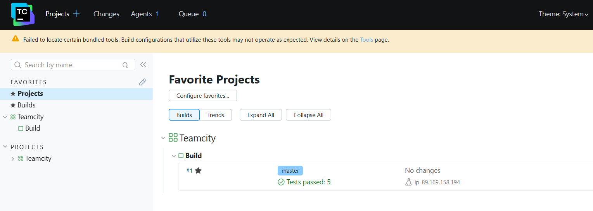
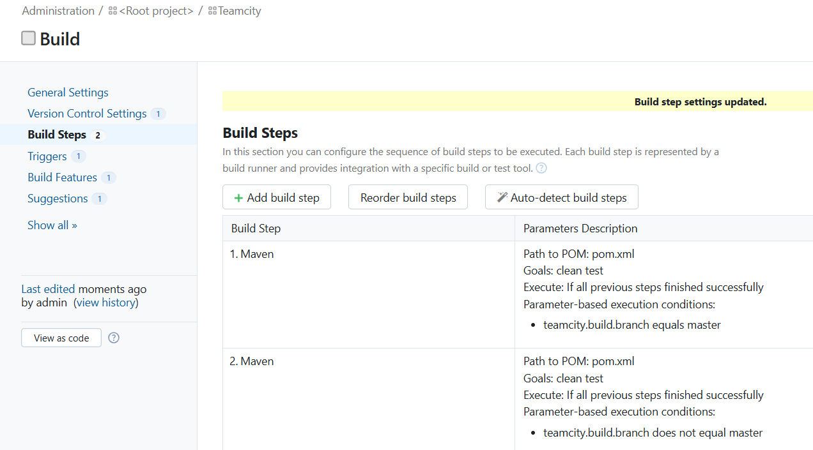
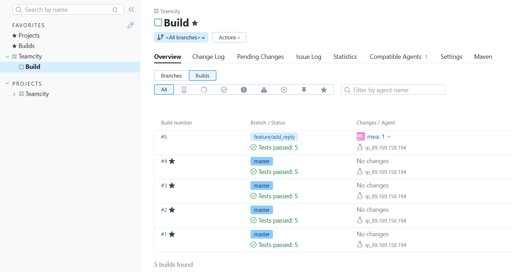
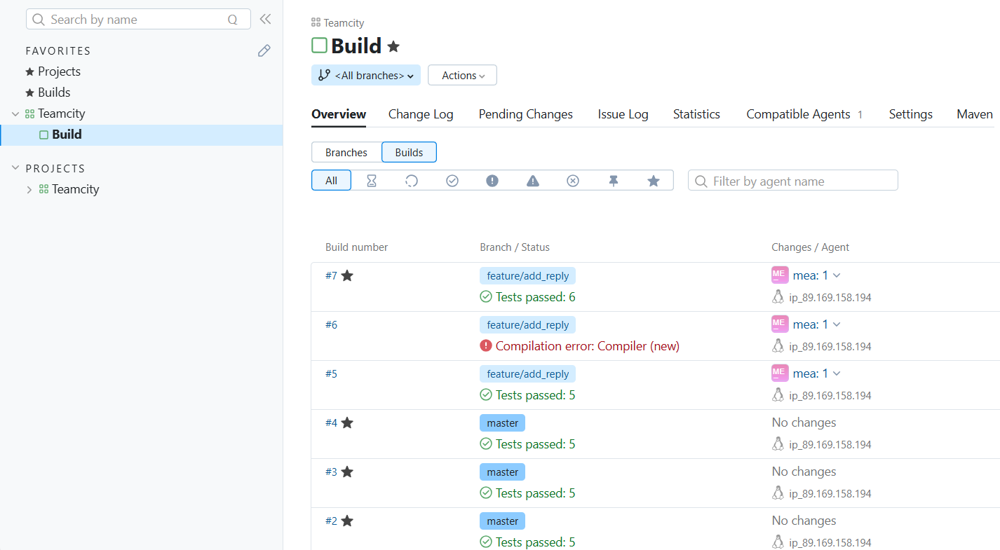

# РАБОТА С TEAMCITY

## Подготовка к выполнению

1. В Yandex Cloud созданы следующие ВМ:
- `teamcity-server` на основе docker-образа `jetbrains/teamcity-server`  (http://89.169.131.120:8111/)
- `teamcity-agent` на основе образа `jetbrains/teamcity-agent` (добавлен в качестве агента сборки на сервере)
- `nexus` (http://89.169.145.49:8081)

2. Создан отдельный репозиторий - [https://github.com/mea2k/teamcity](https://github.com/mea2k/teamcity) как ответвление [этого](https://github.com/aragastmatb/example-teamcity) репозитория.

3. Для ansible настроен файл с описанием узлов - [playbook/inventory/hosts.yml](playbook/inventory/hosts.yml)

4. Исправлен и запущен успешно playbook - [playbook/site.yml](playbook/site.yml):
- добавлена установка зависимости `ACL` ([playbook/site.yml](playbook/site.yml#L19))

## Основная часть

1. В teamcity создан основной проектна основе fork

2. Сделан autodetect конфигурации и запущена первая мборка

3. Результаты запуска первой сборку master'a

4. Добавлены условия сборки: _если сборка по ветке `master`, то должен происходит `mvn clean package`, иначе `mvn clean test`_

5. В репозитории создана отдельную ветку `feature/add_reply` ([https://github.com/mea2k/teamcity/tree/feature/add_reply](https://github.com/mea2k/teamcity/tree/feature/add_reply))

6. В ветку `feature/add_reply` добавлен коммит с новый методом `sayName()` и тестом для неё.

7. Проверка автоматического запуска сборки и анализ результатов.

8. Исправление ошибок в коде и повторный автоматический запуск сборки.

9. В хранилище артефактов нет собранного артефакта в сборке по ветке `master`.

10. Проведена настройка конфигурацию так, чтобы она собирала `.jar` в артефакты сборки.

# Задание
[https://github.com/netology-code/mnt-homeworks/tree/MNT-video/09-ci-05-teamcity](https://github.com/netology-code/mnt-homeworks/tree/MNT-video/09-ci-05-teamcity)
