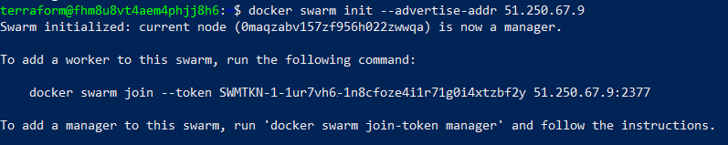
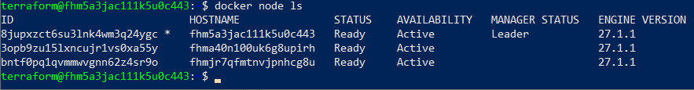
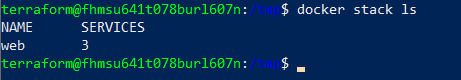
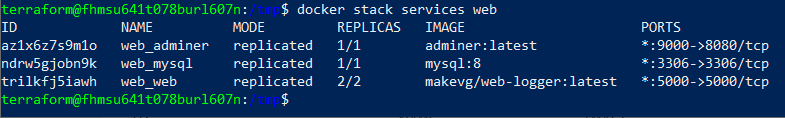

# Docker Swarm

## Задача 1 - инициализация кластера

Для развертывания инфраструктуры используется terraform. Состав инфраструктуры:

- 1 ВМ главный узел
- 2 ВМ рабочие узлы.

Описание инфрасруктуры содержится в файлах:
- [variables.tf](variables.tf) - описание используемых переменных
- [providers.tf](providers.tf) - описание параметров подключения к облаку (Yandex.Cloud)
- [main.tf](main.tf) - описание сетевых параметров
- [1_manager_1.tf](1_manager_1.tf) - управляющая ВМ
- [2_worker_1.tf](2_worker_1.tf) - рабочая ВМ 1
- [3_worker_2.tf](3_worker_2.tf) - рабочая ВМ 2

На всех созданных ВМ устанавливается docker, docker compose, docker machine ([install_docker_machine_compose.sh](install_docker_machine_compose.sh)).

После развертывания ВМ происходит инициализация контейнера. На управляющей ВМ выполняется команда
```
docker swarm init --advertise-addr <Local-IP-address>
```



На рабочих узлах потом выполняется команда
```
docker swarm join --token <TOKEN> <Manager-Local-IP-address>:2377
```

Проверка состава кластера осуществляется с помощью команды
```
docker node ls
```




## Задача 2 - запуск сервисов

Для запуска сервисов был подготовлен файл [compose.yaml](compose.yaml).

Команда по запуску группы сервисов с именем `web` (сперва необходимо скачать все используемые образы):
```
docker pull makevg/web-logger
docker pull adminer
docker pull mysql:8
cd /tmp/
docker stack deploy --with-registry-auth -c ./compose.yaml web
```

Для просмотра количества сервисов в группе необходимо выполнить команду:
```
docker stack ls
```




Список сервисов внутри группы:
```
docker stack services web
```



Детали работы сервиса `mysql` внутри группы:
```
docker service ps --no-trunc web_mysql
```


docker service create --name web --replicas 2 --replicas-max-per-node 1 --constraint node.platform.linux==linux makevg/web-logger


# Дополнительные материалы, которые мне помогли

[https://ru.hexlet.io/courses/terraform-basics/lessons/example-with-db/theory_unit](https://ru.hexlet.io/courses/terraform-basics/lessons/example-with-db/theory_unit) - практика Terraform

[https://ru.hexlet.io/courses/terraform-basics/lessons/secrets/theory_unit](https://ru.hexlet.io/courses/terraform-basics/lessons/secrets/theory_unit) - про секреты в Terraform

[https://habr.com/ru/articles/659813/](https://habr.com/ru/articles/659813/) - работа с Docker Swarm


# Задание
[https://github.com/netology-code/virtd-homeworks/tree/shvirtd-1/05-virt-05-docker-swarm](https://github.com/netology-code/virtd-homeworks/tree/shvirtd-1/05-virt-05-docker-swarm)


