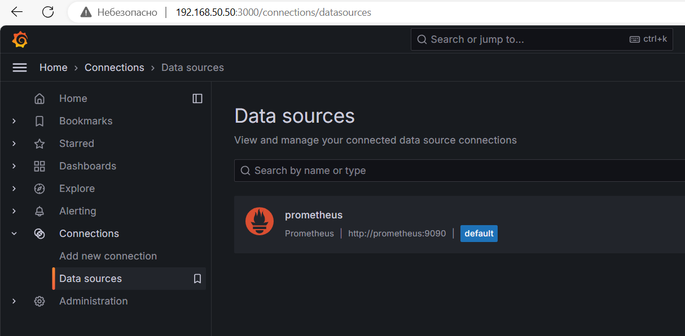
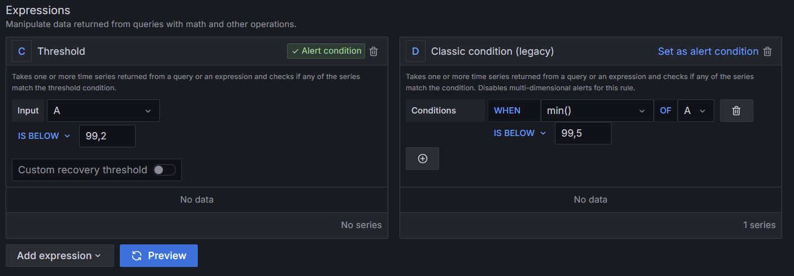
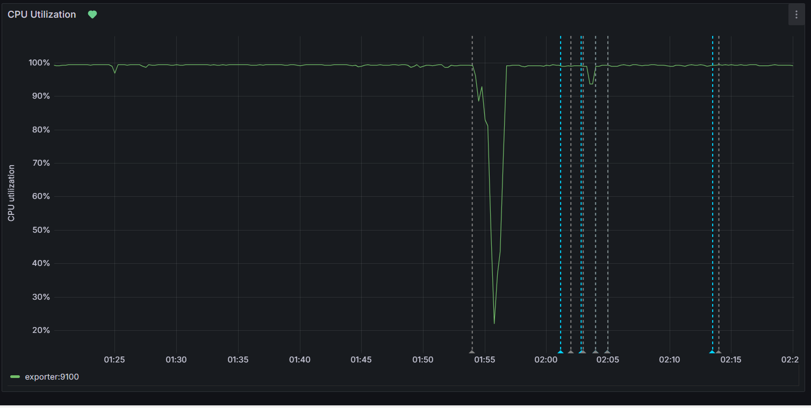
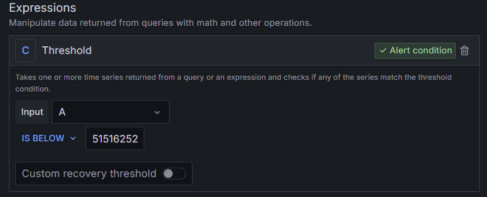

# СРЕДСТВО ВИЗУАЛИЗАЦИИ GRAFANA


## Задание 1

Был подготовлен [docker-compose.yml](docker-compose.yml), в котором описаны следующие контейнеры:

1. `prometheus` - сервис сбора и хранения метрик
  - порт: 9090
  - настройка клиента - сборщика метрик - [prometheus/config/prometheus.yml](prometheus/config/prometheus.yml)
  - локальная сеть: 10.10.0.0/16
  - hostname: prometheus

2. `node-exporter` - сборщик метрик на узле
  - порт 9100
  - локальная сеть: 10.10.0.0/16
  - hostname: exporter

3. `grafana` - средство визуализации метрик
  - порт 3000
  - локальная сеть: 10.10.0.0/16
  - hostname: grafana


### Запуск контейнеров

Для запуска необходимо выполнить команду:
```
docker compose up -d
```

Пороверка корректности запуска:
```
docker ps

CONTAINER ID   IMAGE                       COMMAND                  CREATED             STATUS             PORTS                                       NAMES
9d23a3e926c1   grafana/grafana:latest      "/run.sh"                About an hour ago   Up About an hour   0.0.0.0:3000->3000/tcp, :::3000->3000/tcp   grafana
e6a92ac5c938   prom/prometheus:latest      "/bin/prometheus --c…"   About an hour ago   Up About an hour   0.0.0.0:9090->9090/tcp, :::9090->9090/tcp   prometheus
d6d5ad27b3ce   prom/node-exporter:latest   "/bin/node_exporter …"   About an hour ago   Up About an hour   0.0.0.0:9100->9100/tcp, :::9100->9100/tcp   exporter
```

### Настройка Grafana

Для настройки Grafana были выполнены следующие шаги.

1. Запуск в браузере по пути http://\<localIP\>:3000

2. Смена пароля (по умолчанию, `admin/admin`)

3. Добавление источника: `Data Sources -> Add New Data Source -> Prometheus`




## Задание 2

В Grafan-е создана новая панель (dashboard), в которую добавлены следующие timeseries-графики:

1. `CPU Utilization` - утилизация процессорного ресурса (100% - простой)
  - PromQL: `(avg by (instance) (rate(node_cpu_seconds_total{job="node",mode="idle"}[1m])) * 100)`
  - Unit: `Percent (0-100)`

2. `Node_load` - загрузка процессоров (содержит три графика) 

  * A: PromQL: `node_load1{job="node"}`, legend: `{{name}}`

  * B: PromQL: `node_load5{job="node"}`, legend: `{{name}}`

  * C: PromQL: `node_load15{job="node"}`, legend: `{{name}}`

3. `MemFree (bytes)` - количество свободной оперативной памяти (в байтах)
  - PromQL: `node_memory_MemFree_bytes`
  - Unit: `bytes(IEC)`

4. `FS available (bytes)` - объем свободного места места на файловой системе (в байтах)
  - PromQL: `node_filesystem_avail_bytes{mountpoint="/",fstype!="rootfs"}`
  - Unit: `bytes(IEC)`


## Задание 3

Для получение уведомлений создана контактная запись (Contact Point) с типом - email.


Создание правил реагирования (alert) для созданных панелей:

1. Правило для `CPU Utilization` - _уведомление, если значение меньше 99,5_


Результат работы уведомления:



2. Правило для `FS available (bytes)` - _уведомление, если свободного места меньше 4,8 Гб_



## Задание 4

Экспорт графической панели в формат JSON: файл [dashboard.json](dashboard.json).


# Ссылки в помощь

[https://dockerhosting.ru/blog/zapusk-prometheus-v-docker/](https://dockerhosting.ru/blog/zapusk-prometheus-v-docker/)


# Задание

[https://github.com/netology-code/mnt-homeworks/blob/MNT-video/10-monitoring-03-grafana](https://github.com/netology-code/mnt-homeworks/blob/MNT-video/10-monitoring-03-grafana)

