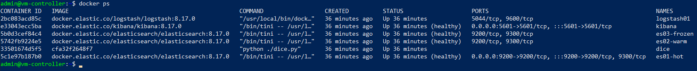
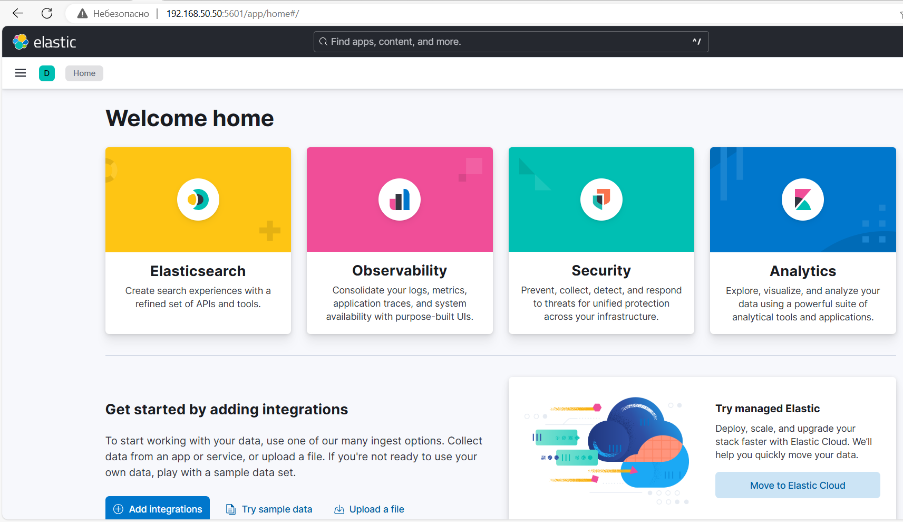
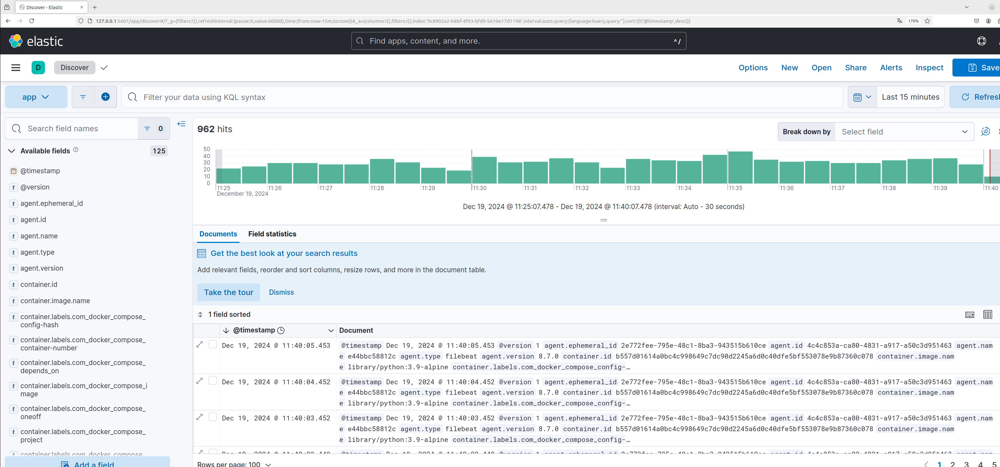

# СИСТЕМА СБОРА ЛОГОВ ELASTIK STACK

## Состав контейнеров

В файле [docker-compose.yml](docker-compose.yml) описаны следующие контейнеры:

1. [Es01](docker-compose.yml#L4) - мастер-сервер СУБД ElasticSearch с ролями: `master, data_content,data_hot`, открыт порт `9200`

2. [Es02](docker-compose.yml#L45) - сервер данных СУБД ElasticSearch с ролями: `master, data_warm`

3. [Es03](docker-compose.yml#L78) - сервер данных СУБД ElasticSearch с ролями: `master, data_frozen`

4. [Kibana](docker-compose.yml#L115) - web-интерфейс Kibana, открыт порт `5601`

6.  [Logstash01](docker-compose.yml#L146) - сборщик данных для СУБД ElasticSearch, конфигурационные файлы [configs/logstash.conf](configs/logstash.conf), [configs/logstash.yml](configs/logstash.yml).

7.  [Filebeats01](docker-compose.yml#L170) - отправитель данных из логов docker-контейнера, конфигурационные файлы [configs/filebeat.yml](configs/filebeat.yml).

8. [Dice](docker-compose.yml#L194) - контейнер бросков кубика (генератор логов)


Файл с настройками - [.env](.env)

__ВАЖНО!__

_Существенно переработал compose.yml файл для работы с новой версией Elastic Stack 8.17.0._


## Программа Dice

Основной файл [dice/dice.py](dice/dice.py)

### Алгоритм работы

1. Программа бросает кубик периодичностью 1 раз в секунду. В результате выдается сообщение о выпавшей грани (от 1 до 6) и количество их выпадания.

Пример - _выпала грань "2", всего выпадений - 5_:
```
INFO:Your dice: 2 (5)!
```

2. Может выпасть _"ребро"_:
```
INFO:EDGE (5)!!
```

3. Может возникнуть ошибка. Шанс ошибки задаётся переменной окружения `ERROR_CHANCE`
```
ERROR:Dice has broken!
```

После ошибки дополнительная задержка в 2 сек.

### Параметры программы

- `ERROR_CHANCE` - шанс ошибки (число от 0 до 100) - шанс к 100 _(по умолчанию, 10)_

- `LOG_PATH` - путь к лог-файлу _(по умолчанию, 'logs')_

- `LOG_FILE` - имя лог-файла _(по умолчанию, 'dice.log')_ 


### Порядок запуска в качестве docker-контейнера

1. Зайти в папку  `/dice`

2. Создать docker-образ:
```
docker build -t dice:1.0 .
```

3. Запустить docker-контейнер с указанием пути, где будет храниться лог-файл (например, _/var/log/dice/_):
```
docker run -d --rm --name dice-log -v /var/log/dice:/usr/src/app/logs dice:1.0
```


## Результаты запуска docker compose

В результате запуска команды `docker compose up --build` запущены все контейнеры.


## Результаты работы Kibana

Web-интерфейс Kibana доступен по порту __5601__.




## Задание 2

В меню просмотра логов в kibana (Discover) и самостоятельно изучите, как отображаются логи и как производить поиск по логам.

В манифесте директории help также приведенно dummy-приложение, которое генерирует рандомные события в stdout-контейнера. Эти логи должны порождать индекс logstash-* в elasticsearch. Если этого индекса нет — воспользуйтесь советами и источниками из раздела «Дополнительные ссылки» этого задания.




# Ссылки в помощь

[Поднимаем elk в docker](https://www.elastic.co/guide/en/elastic-stack-get-started/current/get-started-docker.html);

[Поднимаем elk в docker с filebeat и docker-логами](https://www.sarulabs.com/post/5/2019-08-12/sending-docker-logs-to-elasticsearch-and-kibana-with-filebeat.html);

[Конфигурируем logstash](https://www.elastic.co/guide/en/logstash/current/configuration.html);

[Плагины filter для logstash](https://www.elastic.co/guide/en/logstash/current/filter-plugins.html);

[Конфигурируем filebeat](https://www.elastic.co/guide/en/beats/libbeat/5.3/config-file-format.html);

[Привязываем индексы из elastic в kibana](https://www.elastic.co/guide/en/kibana/current/index-patterns.html);

[Как просматривать логи в kibana](https://www.elastic.co/guide/en/kibana/current/discover.html);

[Решение ошибки increase vm.max_map_count elasticsearch](https://stackoverflow.com/questions/42889241/how-to-increase-vm-max-map-count).


# Задание
[https://github.com/netology-code/mnt-homeworks/tree/MNT-video/10-monitoring-04-elk](https://github.com/netology-code/mnt-homeworks/tree/MNT-video/10-monitoring-04-elk
)
