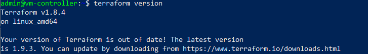
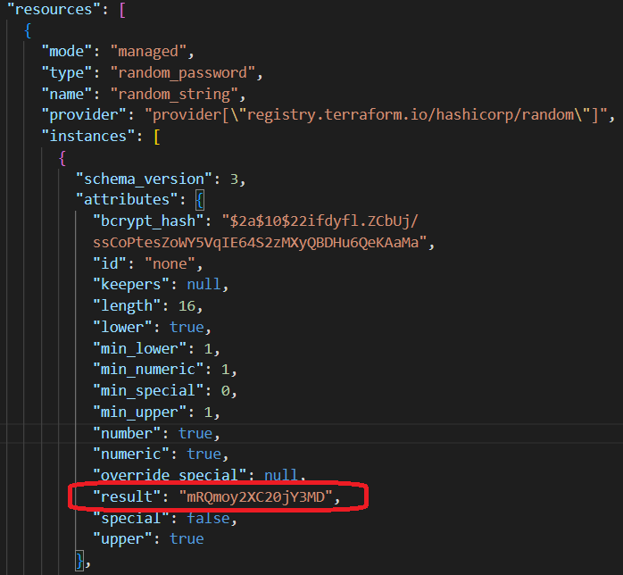
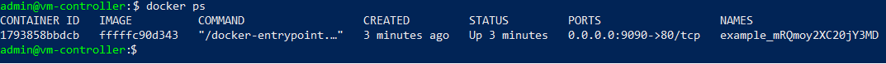
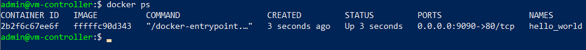
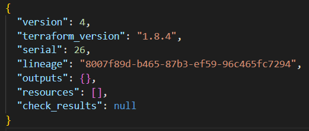

# ВВЕДЕНИЕ в TERRAFORM

## Задача 0 - Подготовка инструмента

Установка Terraform версии 1.8.4




## Задача 1 - Настройка окружения

1. В каком terraform-файле, согласно этому .gitignore, допустимо сохранить личную, секретную информацию? (логины, пароли, ключи, токены и т.д.)

_Ответ: в файлах `personal.auto.tfvars`, а также `secret.auto.tfvars` (добавлено)._

2. Выполнение кода проекта _(без подтверждения)_:
```
terraform apply -auto-approve
```

3. Сгенерированная __random_password__ в файле `.tfstate`



4. Ошибки в коде

```
Error: Missing name for resource
│   on main.tf line 23, in resource "docker_image":
│   23: resource "docker_image" {
│ All resource blocks must have 2 labels (type, name).
```

_Ресурс типа 'docker_image' должен иметь 2 тега: тип и имя. Исправляем на_
```
resource "docker_image" "nginx"
```

```
Error: Invalid resource name
│   on main.tf line 28, in resource "docker_container" "1nginx":
│   28: resource "docker_container" "1nginx" {
│ A name must start with a letter or underscore and may contain only letters, digits, underscores, and dashes.
```

_Неверное имя ресурса (нельзя начинать с цифры). Исправляем на_
```
resource "docker_container" "nginx"
```

```
Error: Reference to undeclared resource
│   on main.tf line 30, in resource "docker_container" "nginx":
│   30:   name  = "example_${random_password.random_string_FAKE.resulT}"
│ A managed resource "random_password" "random_string_FAKE" has not been declared in the root module.
```

_Неверное имя ресурса. Ранее был объявлен ресурс "random_string". Ресурса "random_string_FAKE" нет в файле. Исправляем на "random_string"._
Дополнительно изменяем атрибут ресурса с "resulT" на "result"._


Исправления сохранены в файле [main.tf](main.tf).


5. Выполнение исправленного кода. Результат выполнения команды `docker ps`



6. Изменено имя контейнера на "hello_world" ([main.tf](main.tf#L30)).



Флаг `-auto-approve` нужен в системах автоматического развертывания инфраструктуры, где не требуется ручная настройка.


7. Уничтожение всех созданных ресурсов.
```
terraform destroy
```

Результат - содержимое .tfstate




Docker-образ 'nginx:latest' не был удален, поскольку установлен флаг `keep_locally` ([main.tf](main.tf#L25)). Так реализован ресурс "docker_image" в провайдере "docker". В соответствии с документацией:
```
keep_locally (Boolean) If true, then the Docker image won't be deleted on destroy operation. If this is false, it will delete the image from the docker local storage on destroy operation.
```
[Документация](https://docs.comcloud.xyz/providers/kreuzwerker/docker/latest/docs/resources/image#keep_locally)


# Дополнительные материалы, которые мне помогли

[https://developer.hashicorp.com/terraform/language/syntax/configuration](https://developer.hashicorp.com/terraform/language/syntax/configuration) - синтаксис HCL

[https://developer.hashicorp.com/terraform/language/resources/syntax](https://developer.hashicorp.com/terraform/language/resources/syntax) - синтаксис блока Resources

[https://developer.hashicorp.com/terraform/language/data-sources](https://developer.hashicorp.com/terraform/language/data-sources) - синтаксис блока Data

[https://developer.hashicorp.com/terraform/language/providers/configuration](https://developer.hashicorp.com/terraform/language/providers/configuration) - синтаксис блока Provider


# Задание
[https://github.com/netology-code/ter-homeworks/blob/main/01/hw-01.md](https://github.com/netology-code/ter-homeworks/blob/main/01/hw-01.md)
