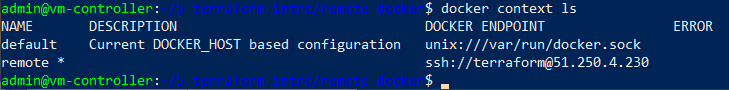
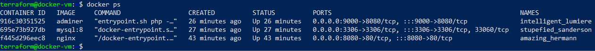
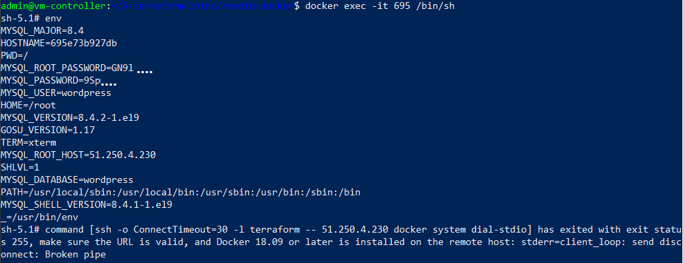
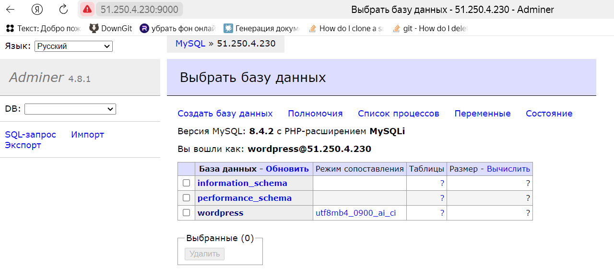

## Задание 2* - Docker context на удалённой ВМ, созданной с помощью Terraform


### Создание ВМ
Описание модуля Terraform:

1. [providers.tf](providers.tf) - описание используемых провайдеров (Yandex.Cloud и Docker)

2. [variables.tf](variables.tf) - описание требуемых для запуска переменных (учетные данные Yandex.Cloud)

3. [main.tf](main.tf) - основной файл, содержащий описание:
  - сети и подсети в Yandex.Cloud
	
	- генераторов символов (`random_password`): `rand_root_pwd` - пароль пользователя root для СУБД, `rand_user_pwd` - пароль основного пользователя СУБД
	
	- ВМ `docker-vm` на базе образа ОС Ubuntu20

	- файл [install_docker_machine_compose.sh](install_docker_machine_compose.sh) - установщик docker и других компонентов - копируется на создаваемую ВМ и потом запускается 

	- в процессе создания ВМ формируется файл `.env`, который копируется в `/tmp` - в нем содержатся переменные окружения для контейнера СУБД (mysql:8)


### Порядок запуска

1. Запуск terraform и ожидание создания ВМ и выполнения сценария установки компонентов (install_docker_machine_compose.sh)
```
terraform apply
```

2. Сохранение внешнего IP-адреса созданного ВМ (`external_ip_address`)

3. Просмотр docker-контекстов на локальной машине
```
docker context ls
```

4. Создание удаленного контекста с подключением к созданной ВМ
```
docker context create remote --docker "host=ssh://{ssh_user}@{external_ip_address}"
```
   - {ssh_user} - пользователь созданной ВМ
	 - {external_ip_address} - внешний IP-адрес созданной ВМ

5. Использование удаленного контекста
```
docker context use remote
```


6. Подготовка переменных окружения для СУБД MySQL
```
terraform output -raw db_env > db.env
```
7. Запуск docker-контейнеров на удаленной ВМ: `MySQL` на порту 3306, `adminer` на порту 9000 и тестовый `nginx` на порту 8080
```
docker run -d -p 8080:80 nginx 
docker run -d -p 3306:3306 --env-file ./db.env -v ./mysql/data:/var/
lib/mysql mysql:8
docker run -d -p 9000:8080 adminer
```

8. Проверка запуска docker-контейнеров. Для этого необходимо установить ssh-соединение с ВМ и выполнить команду:
```
docker ps
```


9. Проверка переменных окружения на docker-контейнере MySQL
```
docker exec -it <MYSQL_CONTAINER_ID> /bin/sh
sh# env
```


10. Проверка создания БД `wordpress` с использованием web-интерфейса Adminer



