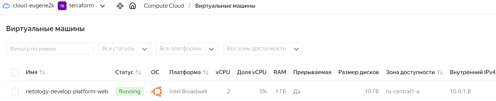
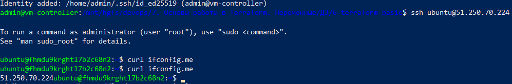
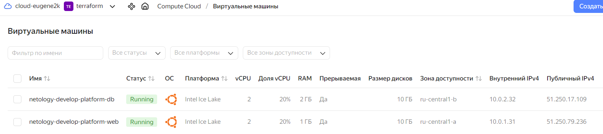
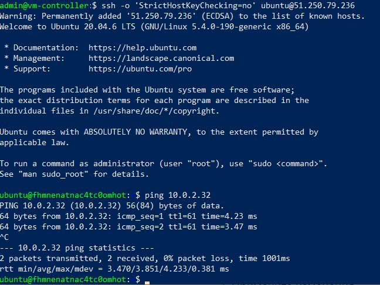
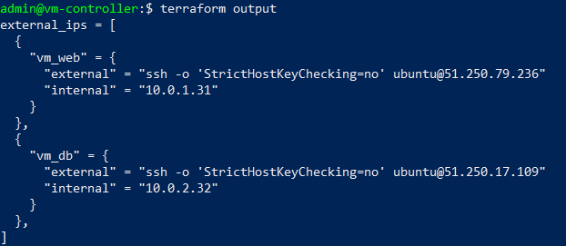

# ОСНОВЫ РАБОТЫ С TERRAFPRM

## Задание 1 - Подготовка и запуск проекта

Исправлены некоторые ошибки, создан сервисный аккаунт, к проекту добавлен файл с ключами (authorized_key.json).

Результат создания и запуска ВМ в консоли Yandex.Cloud


Результат подключения по SSH к созданной ВМ



## Задание 2 - Создание переменных

Дополнен файл [variables.tf](variables.tf) и исправлен файл [main.tf](main.tf) для использования переменных. Теперь "хард-кода" нет!

Все работает так же, даже дешевле _(комбинация standard-v3 + 20%CPU + preemptible=true на текущий момент самая дешевая)_.


## Задание 3 - Создание двух ВМ

Созданы файлы:
- [vm_web_platform.tf](vm_web_platform.tf) - переменные, описывающие ВМ web-платформы
- [vm_db_platform.tf](vm_db_platform.tf) - переменные, описывающие ВМ СУБД
	
Дополнен файл [main.tf](main.tf) - добавлена новая ВМ `netology-develop-platform-db` в зоне "ru-central1-b".

Результат создания ВМ в Yandex.Cloud


Результат выполнения команды `ping <VM2>` из SSH-консоли VM1



## Задание 4 - Output

Дополнен файл [outputs.tf](outputs.tf) - добавлен вывод IP-адресов созданных ВМ.
```
$ terraform output

external_ips = [
  {
    "vm_web" = {
      "external" = "ssh -o 'StrictHostKeyChecking=no' ubuntu@51.250.79.236"
      "internal" = "10.0.1.31"
    }
  },
  {
    "vm_db" = {
      "external" = "ssh -o 'StrictHostKeyChecking=no' ubuntu@51.250.17.109"
      "internal" = "10.0.2.32"
    }
  },
]
```




## Задание 5 - Локальные переменные

Добавлено содержимое файла [locals.tf](locals.tf) - добавлена локальная переменная `vms_name`, содержащая словарь с ключами `{"vm_web", "vm_db"}`. Переменная формирует имя ВМ исходя из префикса (`vm_{web|db}_prefix`), типа платформы (`platform_type`) и название ВМ (`vm_{web|db}_name`). Указанные переменные добавлены в файлы [variables.tf](variables.tf#L40), [vm_web_platform.tf](vm_web_platform.tf#L2), [vm_db_platform.tf](vm_dbb_platform.tf#L2)


Имена созданных ВМ:
- `prod-vmdb-platform-db`
- `prod-vmweb-platform-web` 

## Задание 6 - Единый блок

1. Добавлен блок переменных `vms_resources` в файл [variables.tf](variables.tf#L56).

2. Закомментированы ненужные теперь переменные в файлах [vm_web_platform.tf](vm_web_platform.tf#L38) и [vm_db_platform.tf](vm_db_platform.tf#L38).

3. Добавлен блок локальных переменных `vms_metadata` в файл [locals.tf](locals.tf#L7) - чтобы была возможность проинициализировать значение по умолчанию другой переменной (`var.vms_ssh_root_key`)

4. Исправлен файл [main.tf](main.tf) - изменены ссылки на переменные - теперь всё ссылается только на `vms_resources` и `vms_metadata`.


Результат - создание таких же переменных, что и в прошлых заданиях.


## Задание 7* - Terraform Console

Основной код в файле [console.tf](console.tf)

1. Напишите, какой командой можно отобразить второй элемент списка test_list.
```
> local.test_list[1]
	"staging"
```

2. Найдите длину списка test_list с помощью функции length(<имя переменной>).
```
> length(local.test_list)
	3
```

3. Напишите, какой командой можно отобразить значение ключа admin из map test_map.
```
> local.test_map["admin"]
	"John"
```

4. Напишите interpolation-выражение, результатом которого будет: "John is admin for production server based on OS ubuntu-20-04 with X vcpu, Y ram and Z virtual disks", используйте данные из переменных test_list, test_map, servers и функцию length() для подстановки значений.
```
> "${local.test_map["admin"]} is admin for ${local.test_list[2]} server based on OS ${local.servers["production"].image} with ${local.servers["production"].cpu} vcpu, ${local.servers["production"].ram} ram and ${length(local.servers["production"].disks)} virtual disks"
	"John is admin for production server based on OS ubuntu-20-04 with 10 vcpu, 40 ram and 4 virtual disks"
```

## Задание 7* - Terraform Console 2

1. Тип переменной `test` (добавлена в файл [console.tf](console.tf#L32))
```
> type(local.test)
tuple([
    object({
        dev1: tuple([
            string,
            string,
        ]),
    }),
    object({
        dev2: tuple([
            string,
            string,
        ]),
    }),
    object({
        prod1: tuple([
            string,
            string,
        ]),
    }),
])
```

Моя версия:
```
list(map(list(string)))
```

2. Вычленить _"ssh -o 'StrictHostKeyChecking=no' ubuntu@62.84.124.117"_
```
> local.test[0]["dev1"][0]
	"ssh -o 'StrictHostKeyChecking=no' ubuntu@62.84.124.117"
```


# ЗАДАНИЕ
[https://github.com/netology-code/ter-homeworks/blob/main/02/hw-02.md](https://github.com/netology-code/ter-homeworks/blob/main/02/hw-02.md)
