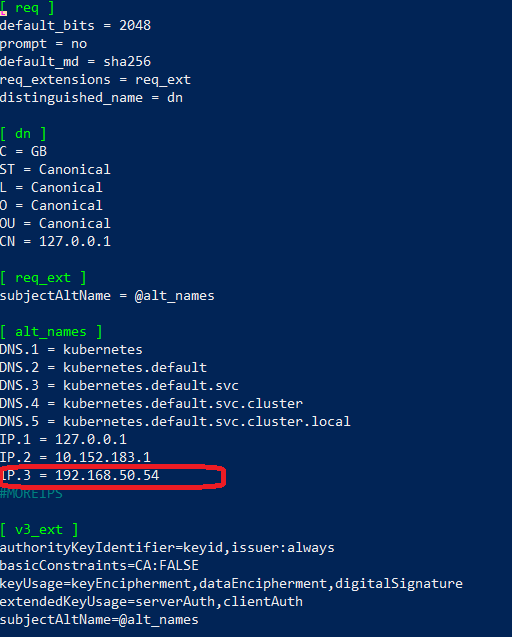

# KUBERNETES. ПРИЧИНЫ ПОЯВЛЕНИЯ. КОМАНДА KUBECTL

## Стенд

### Состав стенда

Стенд состоит из двух виртуальных машин (ВМ) и хостовой машины:
1. Кластерная ВМ - `cluster` (Ubuntu 20) IP: 192.168.50.54
2. ВМ управления - `controller` (Ubuntu 20) IP: 192.168.50.50
3. Хостовой компьютер - `host` (Windows 10) IP: 192.168.50.1

### Настройки стенда

#### Настройка ВМ Cluster

Для создания кластера на базе microk8s были выполнены следующие действия:

1. Установка пакетного менеджера `snapd`
```
sudo apt install snapd
```

2. Установка кластера `microk8s` и настройка прав доступа пользователя
```
sudo snap install microk8s --classic
sudo usermod -a -G microk8s $USER
sudo chown -f -R $USER ~/.kube
```

3. Проверка готовности и запуска кластера
```
microk8s status --wait-ready
microk8s kubectl get nodes
```


4. Установка расширения `dashboard`
```
microk8s enable dashboard
microk8s status
```


5. Настройка модуля `dashboard` - получение токена доступа
```
microk8s kubectl describe secret -n kube-system microk8s-dashboard-token
```


6. Проброс порта для доступа к `dashboard` извне
```
microk8s kubectl port-forward -n kube-system service/kubernetes-dashboard 10443:443 --address 0.0.0.0
```


7. Демонстрация корректной работы dashboard с хостовой машины после ввода токена авторизации


#### Настройка ВМ Controller

Для управления кластером были выполнены следующие действия:

1. Установка `Kubectl` и настройка прав доступа
```
curl -LO https://storage.googleapis.com/kubernetes-release/release/`curl -s https://storage.googleapis.com/kubernetes-release/release/stable.txt`/bin/linux/amd64/kubectl
chmod +x ./kubectl
sudo mv ./kubectl /usr/local/bin/kubectl
```

2. Изменение консоли (bash) для автодополнения команды `kubectl`
```
bash source <(kubectl completion bash)
echo "source <(kubectl completion bash)" >> ~/.bashrc
exit # or bash
```

3. Создание папки с конфигурацией кластера (пока пустой)
```
mkdir .kube
```

4. На ВМ Cluster добавление в конфигурацию кластера внешнего IP-адреса для управления - IP-адреса ВМ Controller. Для этого необходимо внести изменения в файл `/var/snap/microk8s/current/certs/csr.conf.template`


5. Перевыпуск сертификатов и создание конфигурационного файла кластера с именем `config`
```
sudo microk8s refresh-certs --cert front-proxy-client.crt
microk8s config > config
```

6. Копирование конфигурационного файла с ВМ Cluster на ВМ Controller
```
scp ./config admin@192.168.50.50:/home/admin/.kube/config
```

7. На ВМ Controller запуск `kubectl` и применение контекста
```
kubectl config use-context microk8s
```

8. Проверка корректности применённого контекста
```
kubectl config get-contexts
kubectl config current-context
```


## Задания

### Задание 1. Установка MicroK8S

1. Установить MicroK8S на локальную машину или на удалённую виртуальную машину.
2. Установить dashboard.
3. Сгенерировать сертификат для подключения к внешнему ip-адресу.

_Выполнено в ходе настройки ВМ Cluster_


### Задание 2. Установка и настройка локального kubectl
1. Установить на локальную машину kubectl.
2. Настроить локально подключение к кластеру.
3. Подключиться к дашборду с помощью port-forward.

_Выполнено в ходе настройки ВМ Controller_


## Инструменты и дополнительные материалы, которые пригодятся для выполнения задания

[Getting started with Kubernetes: kubectl and microk8s on Ubuntu](https://dev.to/urlichsanais/getting-started-with-kubernetes-kubectl-and-microk8s-on-ubuntu-pko?ysclid=m7bysw7tyz850254682)

[Working with kubectl](https://microk8s.io/docs/working-with-kubectl)

[Addon: dashboard](https://microk8s.io/docs/addon-dashboard)

[Инструкция](https://microk8s.io/docs/getting-started) по установке MicroK8S.

[Инструкция](https://kubernetes.io/ru/docs/reference/kubectl/cheatsheet/#bash) по установке автодополнения **kubectl**.

[Шпаргалка](https://kubernetes.io/ru/docs/reference/kubectl/cheatsheet/) по **kubectl**.


# Задание

[https://github.com/netology-code/kuber-homeworks/blob/main/1.1/1.1.md](https://github.com/netology-code/kuber-homeworks/blob/main/1.1/1.1.md)
