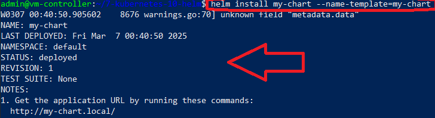
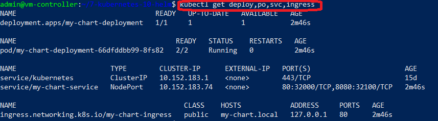
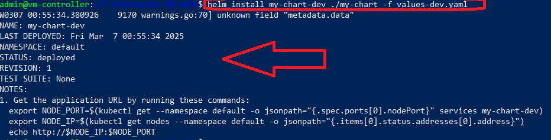
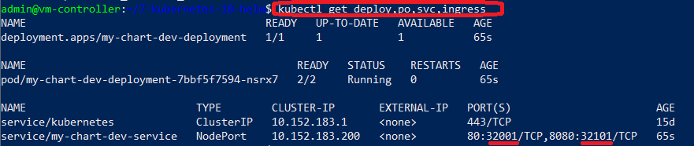
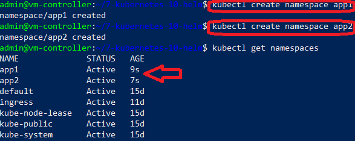
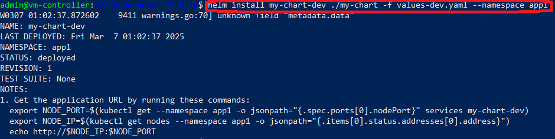
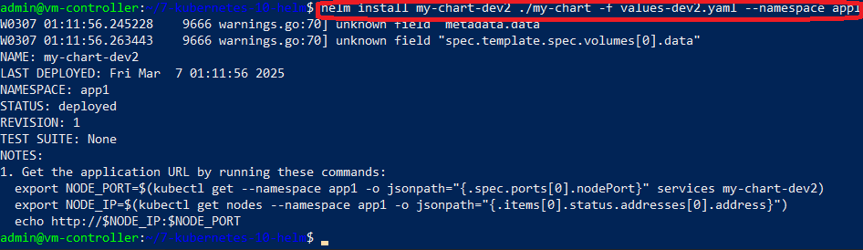
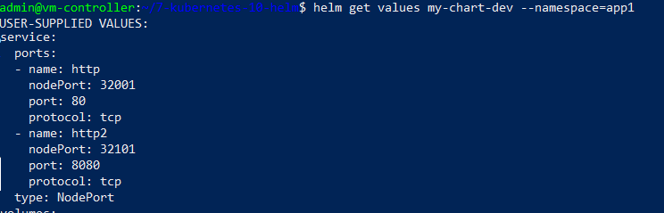
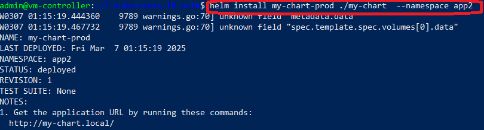
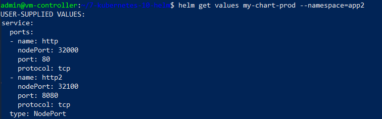

# МЕНЕДЖЕР ПАКЕТОВ HELM В KUBERNETES

## Стенд

Стенд состоит из двух виртуальных машин (ВМ) и хостовой машины:
1. Кластерная ВМ с установленным microk8s - **`cluster`** (Ubuntu 20) IP: **192.168.50.54**
	
	- дополнительно установлены расширения `dashboard`, `ingress`, `hostpath-storage`, `rbac`

2. ВМ управления с установленным kubectl - **`controller`** (Ubuntu 20) IP: **192.168.50.50**
3. Хостовой компьютер - **`host`** (Windows 10) IP: **192.168.50.1**

------

## Задания

### Задание 1. Подготовить Helm-чарт для приложения

1. Создан helm-chart - `my-chart`([my-chart/](my-chart/))

2. Состав:
	- deployment (`my-chart-deployment)
	- под с 2-мя контейнерами (nginx, multotool)
	- configMap для замены html-страницы в Nginx
	- сервис типа NodePort для проброса снаружи внутрь контейнера в поде порт 80 и 8080
	- входной сервис типа Ingress для доступа к поду извне по URL: `http://my-chart.local:32000`


3. Результат запуска с основными параметрами ([my-chart/values.yaml](my-chart/values.yaml))

	Команда:

	```
	helm install my-chart --name-template=my-chart
	```

	Результат:

	

	

4. Результат запуска с другой комбинацией параметров ([values-dev.yaml](values-dev.yaml))


	Команда:

	```
	helm install my-chart-dev ./my-chart -f values-dev.yaml
	```

	Результат:

	

	


------

### Задание 2. Запустить две версии в разных неймспейсах

1. Создание пространства имен `app1`, `app2` в кластере

	Результат:

	

2. Запуск двух приложений в `app2`

	Команды:

	```
	helm install my-chart-dev ./my-chart -f values-dev.yaml --namespace app1
	helm install my-chart-dev2 ./my-chart -f values-dev2.yaml --namespace app1
	```

	Результат:

	

	

	Параметры приложения `my-chart-dev`:

	


3. Запуск приложения в `app2`

	Команды:

	```
	helm install my-chart-prod ./my-chart  --namespace app2
	```

	Результат:

	


	Параметры приложения `my-chart-prod`:

	


------

## Инструменты и дополнительные материалы, которые пригодятся для выполнения задания

[Инструкция  по установке Helm](https://helm.sh/docs/intro/install/).

[Helm completion](https://helm.sh/docs/helm/helm_completion/).

[https://helm.sh/docs/topics/charts/#the-chart-file-structure](https://helm.sh/docs/topics/charts/#the-chart-file-structure).

[Краткое руководство по разработке чартов в Helm - Habr](https://habr.com/ru/companies/vk/articles/516934/)


------

# Задание

[https://github.com/netology-code/kuber-homeworks/blob/main/2.5/2.5.md](https://github.com/netology-code/kuber-homeworks/blob/main/2.5/2.5.md)
