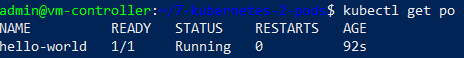
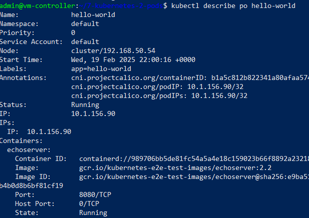
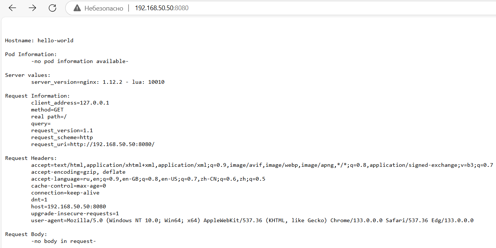
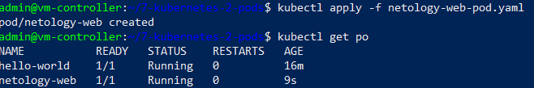
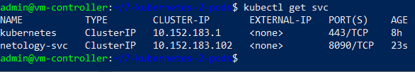
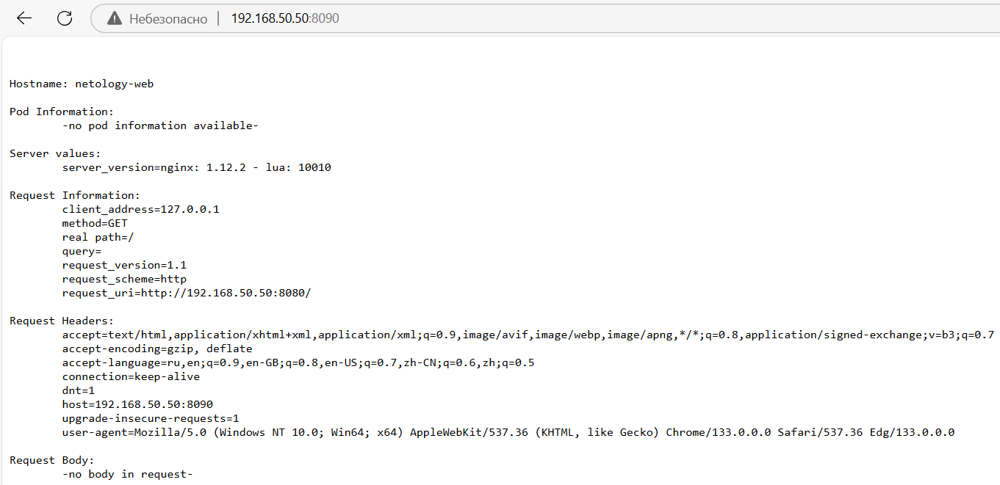

# БАЗОВЫЕ ОБЪЕКТЫ K8S

## Стенд

Стенд состоит из двух виртуальных машин (ВМ) и хостовой машины:
1. Кластерная ВМ с установленным microk8s - `cluster` (Ubuntu 20) IP: 192.168.50.54
2. ВМ управления с установленным kubectl - `controller` (Ubuntu 20) IP: 192.168.50.50
3. Хостовой компьютер - `host` (Windows 10) IP: 192.168.50.1

## Задания

### Задание 1. Создать Pod с именем hello-world

1. Манифест описания Pod-ов - [pods.yaml](pods.yaml).

	Команда:
	```
	kubectl apply -f pods.yaml
	``` 
	
	Создается 1 Pod с именем `echoserver` на основе образа `gcr.io/kubernetes-e2e-test-images/echoserver:2.2` и портом `8080`

2. Проверка запуска Pod-а

	```
	kubectl get po
	```
	
	

	```
	kubectl describe po hello-world
	```

	


3. Подключение к Pod-у используя port-forward

	```
	kubectl port-forward pods/hello-world 8080:8080 --address 0.0.0.0
	```

	Результат обращения по IP-адресу ВМ Controller и порту 8080:
	
	


### Задание 2. Создать Service и подключить его к Pod

1. Манифест описания Pod-а - [netology-web-pod.yaml](netology-web-pod.yaml).
   
	Команда:
	```
	kubectl apply -f netology-web-pod.yaml
	``` 
	
	Создается 1 Pod с именем `netology-web` на основе образа `gcr.io/kubernetes-e2e-test-images/echoserver:2.2` и портом `8080`

2. Проверка запуска Pod-а

	```
	kubectl get po
	```
	
	

3. Создание Service с именем `netology-svc` и подключить к netology-web - файл [services.yaml](services.yaml)
	
	Команда:
	
	```
	kubectl apply -f services.yaml
	```

	Результат:
	
	

4. Подключение к Service с помощью `kubectl port-forward`

	Команда:
	```
	kubectl port-forward services/netology-svc 8090:8090 --address 0.0.0.0
	```

	Результат обращения по IP-адресу ВМ Controller и порту 8090:
	
	


## Инструменты и дополнительные материалы, которые пригодятся для выполнения задания

Описание [Pod](https://kubernetes.io/docs/concepts/workloads/pods/) и примеры манифестов.

Описание [Service](https://kubernetes.io/docs/concepts/services-networking/service/).


# Задание

[https://github.com/netology-code/kuber-homeworks/blob/main/1.2/1.2.md](https://github.com/netology-code/kuber-homeworks/blob/main/1.2/1.2.md)
