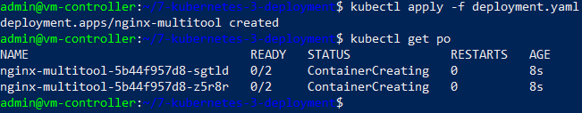
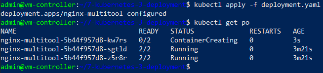
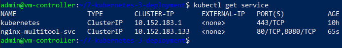
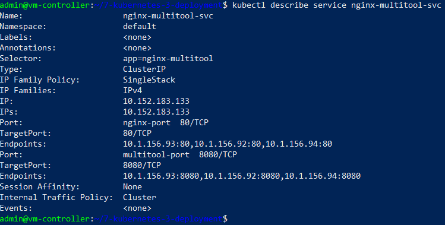
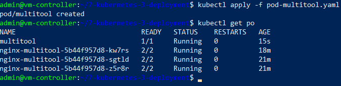
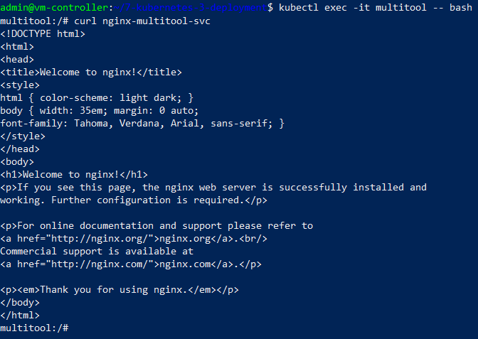
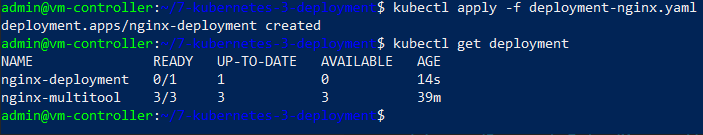
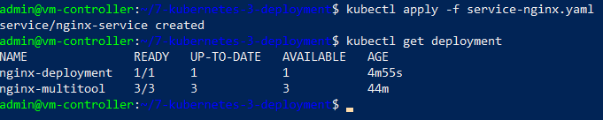

# ЗАПУСК ПРИЛОЖЕНИЙ В KUBERNETES

## Стенд

Стенд состоит из двух виртуальных машин (ВМ) и хостовой машины:
1. Кластерная ВМ с установленным microk8s - `cluster` (Ubuntu 20) IP: 192.168.50.54
2. ВМ управления с установленным kubectl - `controller` (Ubuntu 20) IP: 192.168.50.50
3. Хостовой компьютер - `host` (Windows 10) IP: 192.168.50.1

## Задания

### Задание 1. Создать Deployment и обеспечить доступ к репликам приложения из другого Pod

1. Манифест-файл - [deployment.yaml](deployment.yaml):
	- имя: `nginx-multitool`
	
	- количество реплик: 2

	- фильтр на метки: `app: nginx-multitool`

	- контейнеры: `nginx` (порт 80) и `multitool` (порт 8080)

	
2. Запуск deployment

	Команда:
	```
	kubectl apply -f deployment.yaml
	```

	Результат:
	

2. Изменение числа реплик в файле [deployment.yaml](deployment.yaml#L6) на 3.

3. Повторное применение файла и вывод созданных Pod-ов

	

4. Создание сервиса для доступа к Pod-ам - файл [service.yaml](service.yaml)

	- имя: `nginx-multitool-svc`
	
	- фильтр: `app: nginx-multitool`

	- порты: 80 (nginx) и 8080 (multitool)


5. Результат создания сервиса

	Команда
	
	```
	kubectl get service
	```

	Результат:
	

	Команда
	
	```
	kubectl describe service nginx-multitool-svc
	```

	Результат:
	

	
5. Запуск отдельного Pod-а на базе образа `multitool` - файл [pod-multitool.yaml](pod-multitool.yaml)

	Команда:
	```
	kubectl apply -f pod-multitool.yaml
	kubectl get po
	```

	Результат:
	


6. Проверка доступности из Pod-а multitool приложения nginx-multitool

	Команда:
	```
	kubectl exec -it multitool -- bash
	```

	Для проверки доступности внутри Pod-а выполняем команду `curl nginx-multitool-svc`

	Результат:
	


### Задание 2. Создать Deployment и обеспечить старт основного контейнера при выполнении условий

1. Создан сервис для запуска приложения nginx - файл [service-nginx.yaml](service-nginx.yaml)
	
	- имя сервиса: `nginx-service`
	- образ: `nginx:latest`
	- порт контейнера: 80
	- порт для внешнего обращения: 81

	_Сервис пока НЕ запускатеся!_

2. Создано Deployment для запуска сервиса 'nginx-service' - файл [deployment-nginx.yaml](deployment-nginx.yaml)

	- имя: `nginx-deployment`
	
	- количество реплик: 1

	- фильтр: `app: nginx`

	- контейнер инициализации: `wait-for-service`, ждет доступности сервиса по имени `nginx-service.default.svc.cluster.local`

	- основной контейнер: `nginx`


3. Запуск Deployment

	Команда:
	```
	kubectl apply -f deployment-nginx.yaml
	kubectl get deployment
	```

	Результат - _неуспешный_:
	```
	NAME               READY   UP-TO-DATE   AVAILABLE   AGE
	nginx-deployment   0/1     1            0           14s
	```

	

4. Запуск сервиса 'nginx-service'

	Команда запуска и проверки deployment:
	
	```
	kubectl apply -f service-nginx.yaml
	kubectl get deployment
	```

	Результат - _успешный_:

	


## Инструменты и дополнительные материалы, которые пригодятся для выполнения задания

[Описание](https://kubernetes.io/docs/concepts/workloads/controllers/deployment/) Deployment и примеры манифестов.

[Описание](https://kubernetes.io/docs/concepts/workloads/pods/init-containers/) Init-контейнеров.

[Описание](https://github.com/wbitt/Network-MultiTool) Multitool.


# Задание

[https://github.com/netology-code/kuber-homeworks/blob/main/1.3/1.3.md](https://github.com/netology-code/kuber-homeworks/blob/main/1.3/1.3.md)
