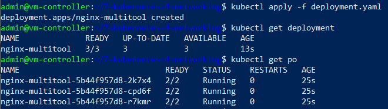
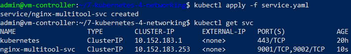
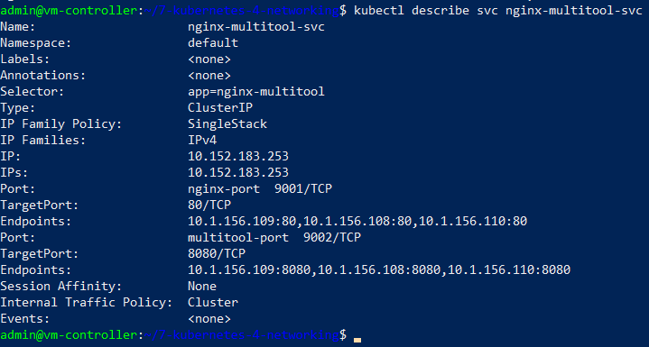
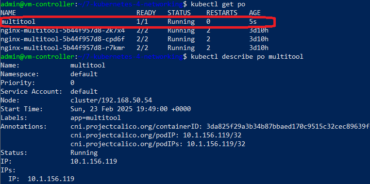
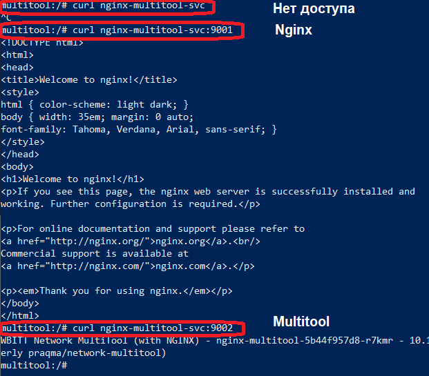
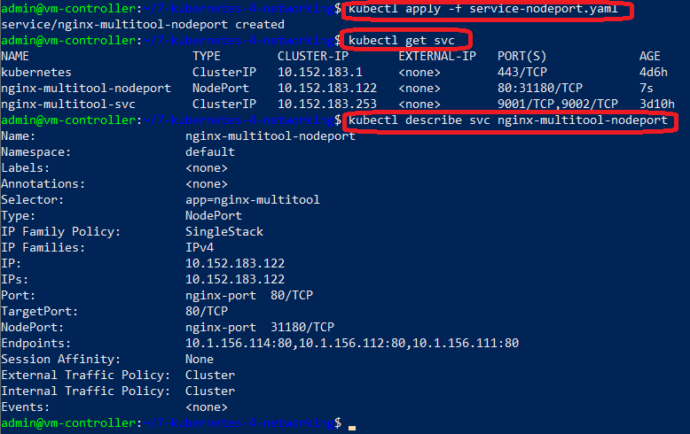
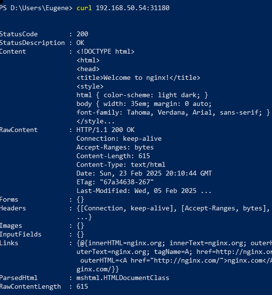

# СЕТЕВОЕ ВЗАИМОДЕЙСТВИЕ В KUBERNETES

## Стенд

Стенд состоит из двух виртуальных машин (ВМ) и хостовой машины:
1. Кластерная ВМ с установленным microk8s - `cluster` (Ubuntu 20) IP: 192.168.50.54
2. ВМ управления с установленным kubectl - `controller` (Ubuntu 20) IP: 192.168.50.50
3. Хостовой компьютер - `host` (Windows 10) IP: 192.168.50.1

## Задания

### Задание 1. Создать Deployment и обеспечить доступ к контейнерам приложения по разным портам из другого Pod внутри кластера

1. Deployment: файл - [deployment.yaml](deployment.yaml):
	
	- имя: `nginx-multitool`
	
	- количество реплик: 3

	- фильтр на метки: `app: nginx-multitool`

	- контейнеры: `nginx` (порт 80) и `multitool` (порт 8080)
	
2. Запуск deployment и проверка результатов запуска

	Команда запуска:
	```
	kubectl apply -f deployment.yaml
	```

	Команды проверки:
	```
	kubectl get deployment
	kubectl get po
	```

	Результат:

	


3. Создание сервиса для доступа к Pod-ам - файл [service.yaml](service.yaml)

	- имя: `nginx-multitool-svc`

	- тип: `ClusterIP` (_по умолчанию_)
	
	- фильтр: `app: nginx-multitool`

	- порты внутренние: `80` (nginx) и `8080` (multitool)

	- порты внешние: `9001` (nginx) и `9002` (multitool)

4. Результаты создания сервиса

	Команда запуска:
	
	```
	kubectl apply -f service.yaml
	```

	Команды проверки:

	```
	kubectl get svc
	kubectl describe svc nginx-multitool-svc
	```
	
	Результат:

	


	


5. Создание отдельного Pod-а - файл [pod-multitool.yaml](pod-multitool.yaml)

	- имя: `multitool`

	- метка: `app: multitool`

	- образ: `wbitt/network-multitool:latest`

	Команда проверки результата запуска Pod-а:
	
	```
	kubectl get po
	kubectl describe pod multitool
	```

	Результат:

	

6. Проверка доступности сервисов внутри Pod-а

	Команда подключения к Pod-у:
	```
	kubectl exec -it multitool -- bash
	```
	
	Проверка доступа к контейнерам внутри сервиса `nginx-multitool-svc` (порты `9001` и `9002`) осуществлялась с использованием утилиты `curl`, запускаемой внутри Pod-а `multitool`.

	Результаты:

	


### Задание 2. Создать Service и обеспечить доступ к приложениям снаружи кластера

1. Создание сервиса для доступа к контейнерам извне [service-nodeport.yaml](service-nodeport.yaml)

	- имя: `nginx-multitool-nodeport`

	- тип: `NodePort`
	
	- фильтр: `app: nginx-multitool`

	- порты внутренние: `80` (nginx)

	- порты внешние: `31180` (nginx)

2. Результаты создания сервиса

	Команда запуска:
	
	```
	kubectl apply -f service-nodeport.yaml
	```

	Команды проверки:

	```
	kubectl get svc
	kubectl describe svc nginx-multitool-nodeport
	```
	
	Результат:

	


3. Проверка доступа к сервису извне

	ДЛя проверки доступа выполнена команда `curl` на хостовой машине с обращением на ВМ кластера (`192.168.50.54`) по порту `31180`.

	Результат:

	


## Инструменты и дополнительные материалы, которые пригодятся для выполнения задания

[Kubernetes bare metal](https://habr.com/ru/companies/X5Tech/articles/645651/)

[Описание](https://kubernetes.io/docs/concepts/workloads/controllers/deployment/) Deployment и примеры манифестов.

[Описание](https://kubernetes.io/docs/concepts/services-networking/service/) Описание Service.

[Описание](https://github.com/wbitt/Network-MultiTool) Multitool.


# Задание

[https://github.com/netology-code/kuber-homeworks/blob/main/1.4/1.4.md](https://github.com/netology-code/kuber-homeworks/blob/main/1.4/1.4.md)
