# СЕТЕВОЕ ВЗАИМОДЕЙСТВИЕ В KUBERNETES. INGRESS

## Стенд

Стенд состоит из двух виртуальных машин (ВМ) и хостовой машины:
1. Кластерная ВМ с установленным microk8s - `cluster` (Ubuntu 20) IP: 192.168.50.54
	
	- дополнительно установлены расширения `dashboard`, `ingress`

2. ВМ управления с установленным kubectl - `controller` (Ubuntu 20) IP: 192.168.50.50
3. Хостовой компьютер - `host` (Windows 10) IP: 192.168.50.1

## Задания

### Задание 1. Создать Deployment приложений backend и frontend

#### 1. Frontend

1. Deployment _frontend_: файл - [frontend.yaml](frontend.yaml):
	
	- имя: `frontend`
	
	- количество реплик: `3`

	- фильтр на метки: `app: frontend`

	- контейнеры: `nginx` (порт 80)

	- замена `index.html` на _"frontend"_


2. Cервис _frontend_: файл - [frontend.yaml](frontend.yaml#L28):

	- имя: `frontend-service`

	- тип: `ClusterIP` (по умолчанию)
	
	- фильтр: `app: frontend`

	- порты внутренние: `80` (nginx)

	- порты внешние: `80` (nginx)


3. ConfigMap _frontend_: файл - [frontend.yaml](frontend.yaml#L41):

	- имя: `frontend-html`

	- данные: содержимое файла `index.html`


4. Результаты запуска

	Команда:
	```
	kubectl apply -f frontend.yaml
	```

	Запуск deployment:

	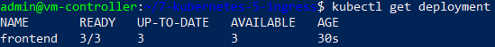


	Запуск service:

	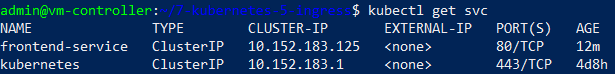

	
	Запуск pods:

	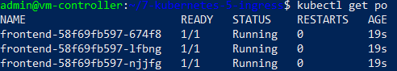


#### 2. Backend

1. Deployment _backend_: файл - [backend.yaml](backend.yaml):
	
	- имя: `backend`
	
	- количество реплик: `1`

	- фильтр на метки: `app: backend`

	- контейнеры: `multitool` (порт 80)

	- замена `index.html` на _"backend"_


2. Cервис _backend_: файл - [backend.yaml](backend.yaml#L28):

	- имя: `backend-service`

	- тип: `ClusterIP` (по умолчанию)
	
	- фильтр: `app: backend`

	- порты внутренние: `80` (nginx)

	- порты внешние: `80` (nginx)


3. ConfigMap _backend_: файл - [backend.yaml](backend.yaml#L41):

	- имя: `backend-html`

	- данные: содержимое файла `index.html`


4. Результаты запуска

	Команда:
	```
	kubectl apply -f backend.yaml
	```

	Запуск deployment:

	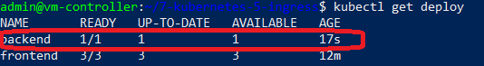


	Запуск service:

	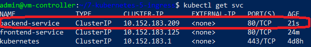

	
	Запуск pods:

	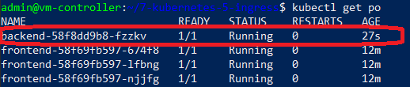


#### 3. Проверка доступа

1. Проверка доступа имен `backend-service` и `frontend-service` из контейнера _frontend_

	Команда:
	```
	kubectl exec -it frontend-58f69fb597-674f8 -- bash
	```

	Результат проверки `backend-service`:
	
	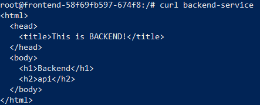


	Результат проверки `frontend-service`:
	
	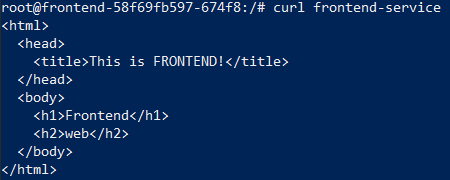


2. Аналогично проверена доступность сервисов из контейнра _backend_ - _УСПЕШНО!_


### Задание 2. Создать Ingress и обеспечить доступ к приложениям снаружи кластера

1. Создание Ingress - файл [ingress.yaml](ingress.yaml)

	- имя: `app-ingress`
	
	- домен: ""

	- путь "/" - переводится на `frontend-service:80/`

	- путь "/api" - переводится на `backend-service:80/`
	
2. Результаты запуска

	Команда:
	```
	kubectl apply -f ingress.yaml
	```

	Результат:

	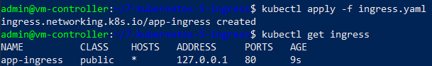

3. Проверка корректности работы Ingress

	- доступ из хостовой машины по пути `http://192.168.50.54`

		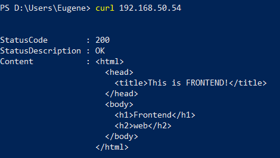

	- доступ из хостовой машины по пути `http://192.168.50.54/api`

		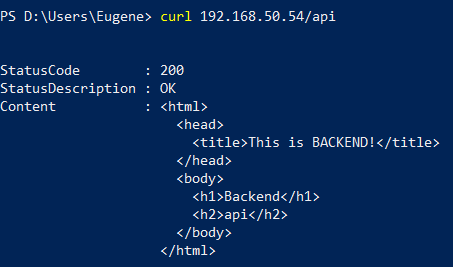


## Инструменты и дополнительные материалы, которые пригодятся для выполнения задания

[ConfigMap](https://bytegoblin.io/blog/how-to-change-nginx-index-html-in-kubernetes-with-configmap).

[Инструкция](https://microk8s.io/docs/getting-started) по установке MicroK8S.

[Описание](https://kubernetes.io/docs/concepts/services-networking/service/) Service.

[Описание](https://kubernetes.io/docs/concepts/services-networking/ingress/) Ingress.

[Описание](https://github.com/wbitt/Network-MultiTool) Multitool.


# Задание

[https://github.com/netology-code/kuber-homeworks/blob/main/1.5/1.5.md](https://github.com/netology-code/kuber-homeworks/blob/main/1.5/1.5.md)
