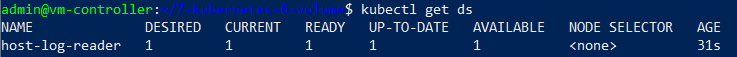

# ХРАНЕНИЕ В KUBERNETES. VOLUMES

## Стенд

Стенд состоит из двух виртуальных машин (ВМ) и хостовой машины:
1. Кластерная ВМ с установленным microk8s - `cluster` (Ubuntu 20) IP: 192.168.50.54
	
	- дополнительно установлены расширения `dashboard`, `ingress`

2. ВМ управления с установленным kubectl - `controller` (Ubuntu 20) IP: 192.168.50.50
3. Хостовой компьютер - `host` (Windows 10) IP: 192.168.50.1

## Задания

### Задание 1 

1. Deployment _shared-app_: файл - [deployment-shared-app.yaml](deployment-shared-app.yaml):
	
	- имя: `shared-data-app`
	
	- количество реплик: `1`

	- фильтр на метки: `app: shared-data`

	- контейнеры: `busybox`, `multitool`

	- volume: `shared-data-volume` (тип emptyDir), монтирован в папку `/data/` на обоих контейнерах

2. Особенности контейнеров:
	
	а) `busybox` каждые 5 сек пишет в файл `/data/shared.txt` строку "$(date) - Data written by busybox"

	Исполняемый контейнером код (bash):
	```
	while true;
		do echo "$(date) - Data written by busybox" >> /data/shared.txt;
		sleep 5;
	done;
	```

	b) `multitool` каждые 1 сек считывает содержимое файла `/data/shared.txt`

	Исполняемый контейнером код (bash):
	```
	while true;
		do cat /data/shared.txt;
		sleep 1;
	done;
	```

3. Результаты запуска

	Команда:
	```
	kubectl apply -f deployment-shared-app.yaml
	```

	Результаты запуска deployment:

	

	

4. Демонстрация работы контейнеров

	1. Чтение содержимого файла из контейнера `busybox`

		Команда:
		```
		kubectl exec -it shared-data-app-7c7df69579-wjvx5 -c busybox -- sh
		```

		Результат:

		
	
	2. Чтение содержимого файла из контейнера `multitool`

		Команда:
		```
		kubectl exec -it shared-data-app-7c7df69579-wjvx5 -c multitool -- sh
		```

		Результат:

		


### Задание 2

1. Daemonset _host-log-reader_: файл - [daemonset-logreader.yaml](daemonset-logreader.yaml):
	
	- имя: `host-log-reader`
	
	- количество реплик: _по умолчанию по 1 реплики на каждом узле кластера_

	- фильтр на метки: `app: host-log-reader`

	- контейнеры: `multitool`

	- volume: `log-volume` (тип hostPath), монтирован в папку `/logs/`, только для чтения, использует локальную папку узла `/var/logs/`

2. Особенности контейнера `multitool`

	Каждые 10 сек считывает содержимое файла `/logs/syslog`

	Исполняемый контейнером код (bash):
	```
	while true;
		do cat /logs/syslog;
		sleep 10;
	done;
	```

3. Результаты запуска

	Команда:
	```
	kubectl apply -f daemonset-logreader.yaml
	```

	Результаты запуска deployment:

	

	

4. Демонстрация работы контейнера

	1. Чтение содержимого каталога `/logs/` из контейнера `multitool` в `host-log-reader`

		Команда:

		```
		kubectl exec -it host-log-reader-vvdvb -- sh
		```

		Результат:

		
	
	2. Чтение содержимого каталога `/var/logs/` на ВМ cluster

		Команда:
		```
		ls -la /var/logs
		```

		Результат:

		


## Инструменты и дополнительные материалы, которые пригодятся для выполнения задания

[Дополнительные материалы](https://github.com/netology-code/devkub-homeworks/tree/main/13-kubernetes-config)

[Инструкция по установке MicroK8S](https://microk8s.io/docs/getting-started).

[Описание Volumes](https://kubernetes.io/docs/concepts/storage/volumes/).

[Описание Multitool](https://github.com/wbitt/Network-MultiTool).


# Задание

[https://github.com/netology-code/kuber-homeworks/blob/main/2.1/2.1.md](https://github.com/netology-code/kuber-homeworks/blob/main/2.1/2.1.md)
