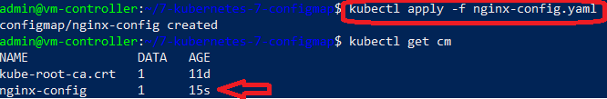
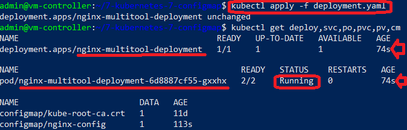
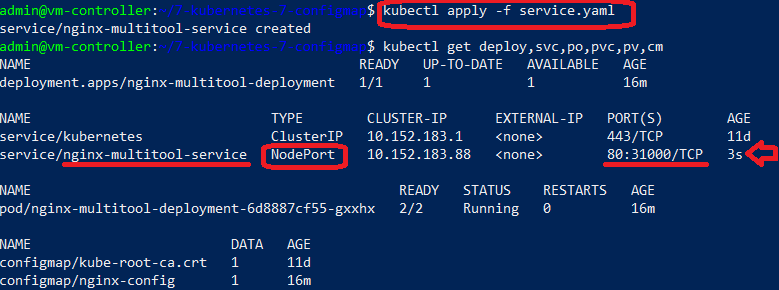
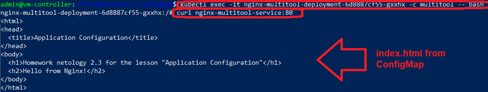
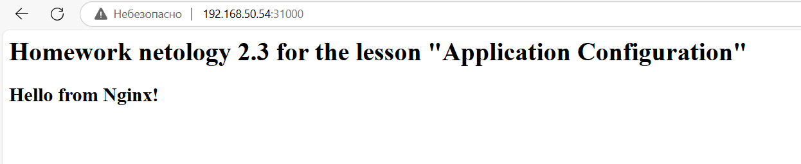
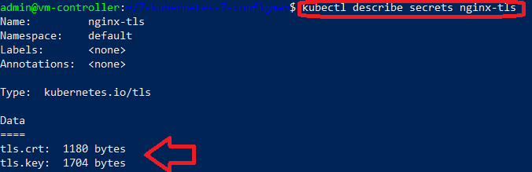
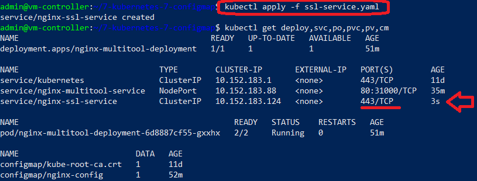
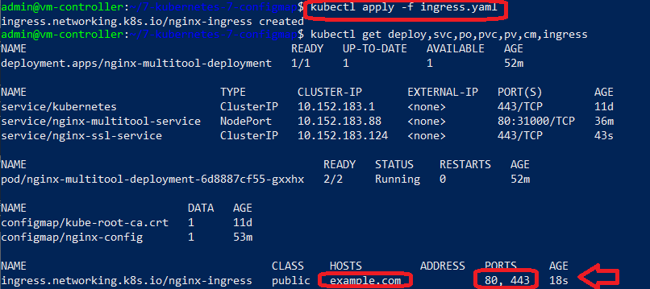

# КОНФИГУРАЦИЯ ПРИЛОЖЕНИЙ В KUBERNETES. CONFIGMAP, SECRET

## Стенд

Стенд состоит из двух виртуальных машин (ВМ) и хостовой машины:
1. Кластерная ВМ с установленным microk8s - **`cluster`** (Ubuntu 20) IP: **192.168.50.54**
	
	- дополнительно установлены расширения `dashboard`, `ingress`, `hostpath-storage`

2. ВМ управления с установленным kubectl - **`controller`** (Ubuntu 20) IP: **192.168.50.50**
3. Хостовой компьютер - **`host`** (Windows 10) IP: **192.168.50.1**

------

## Задания

### Задание 1. Создать Deployment приложения и решить возникшую проблему с помощью ConfigMap. Добавить веб-страницу


1. Deployment _nginx-multitool-deployment_: файл - [deployment.yaml](deployment.yaml):
	
	- имя: `nginx-multitool-deployment`
	
	- количество реплик: `1`

	- фильтр на метки: `app: nginx-multitool`

	- контейнеры: `nginx:latest`, `multitool:latest`

	- volume: `html-config`:
		
		- тип: `configMap`

		- имя подгружаемой конфигурации: `nginx-config` _(должна быть создана ДО запуска deployment)_


2. Контейнеры:
	
	а) `nginx` 
	
	- порт: `80`

	- volumeMounts: `html-config`, монтирует в папку `/usr/share/nginx/html`


	b) `multitool` каждые 10 сек считывает содержимое файла `/data/shared.txt`

	- порт: `8080`

	- задаётся переменная окружения: `HTTP_PORT: "8080"` 


3. Конфигурация _nginx-config_: файл - [nginx-config.yaml](nginx-config.yaml)

	|Ключ|Значение|
	|-----------|-----------|
	|index.html|Новое содержимое HTML-страницы|


4. Cервис _nginx-multitool-service_: файл - [service.yaml](service.yaml):

	- имя: `nginx-multitool-service`

	- тип: `NodePort`
	
	- фильтр: `app: nginx-multitool`

	- порты внутренние: `80` (nginx)

	- порты внешние: `31000` (nginx)


5. Результаты запуска

	1. Создание ConfigMap
		
		Команда:
		
		```
		kubectl apply -f nginx-config.yaml
		kubectl get cm
		```

		Результаты запуска:

		

	2. Создание deployment

		Команда:
		
		```
		kubectl apply -f deployment.yaml
		kubectl get deploy,svc,po,pvc,pv,cm
		```

		Результаты запуска:

		

	3. Создание сервиса для доступа к контейнерам извне кластера

		Команда:
		
		```
		kubectl apply -f service.yaml
		kubectl get deploy,svc,po,pvc,pv,cm

		```

		Результаты запуска:

		


6. Проверка доступа к контейнерам внутри и извне кластера

	1. Анализ доступа изнутри контейнера `multitool`

		Команды:
		
		```
		kubectl exec -it nginx-multitool-deployment-6d8887cf55-gxxhx -c multitool -- bash
		curl nginx-multitool-service:80
		```

		Результаты:

		

	2. Анализ доступа изнвне кластера

		Открываем содержимое web-страницы по адресу: `clusterIP:31000`
		
		Результат:

		


------

### Задание 2. Создать приложение с вашей веб-страницей, доступной по HTTPS 

1. Создание сертификатов для работы по протоколу HTTPS (TLS).

	1. Создание файлов сертификата (.crt) и ключа (.key) для домена `example.com`

		```
		openssl req -x509 -nodes -newkey rsa:2048 -keyout keys/tls.key -out keys/tls.crt -subj "/CN=example.com/O=example.com"
		```

		_Результат:_ в папке `keys` создаются файлы `keys/tls.key` и `keys/tls.crt`.

	2. Создание Secret для хранения сертификатов в кластере

		```
		kubectl create secret tls nginx-tls --cert=keys/tls.crt --key=keys/tls.key
		```

		_Результат:_ создается объект `Secret` с именем `nginx-tls`, содержащий поля:
		
		|Ключ|Значение|
		|-----------|-----------|
		|tls.crt|base64 encoded TLS-cert|
		|tls.key|base64 encoded TLS-key|

		
		
2. Создание сервиса для доступа извне _nginx-ssl-service_: файл - [ssl-service.yaml](ssl-service.yaml):

	- имя: `nginx-ssl-service`

	- тип: `ClusterIP` _(по умолчанию)_
	
	- фильтр: `app: nginx-multitool`

	- порты внутренние: `80` (nginx)

	- порты внешние: `443`

	Запуск:

	```
	kubectl apply -f ssl-service.yaml
	```

	Результат:

	


3. Создание Ingress-сервиса для доступа извне _nginx-ingress_: файл - [ingress.yaml](ingress.yaml):

	- имя: `nginx-ingress`

	- тип: `Ingress`
	
	- домены (hosts): `example.com`

	- перенаправление на сервис `nginx-ssl-service`, порт `443`

	- использование данных из секрета `nginx-tls`
	
	Запуск:

	```
	kubectl apply -f ingress.yaml
	```

	Результат:
	
	


4. Проверка доступности сервисов извне кластера по протоколу HTTPS

	>***Внимание!***
	>
	>_Для корректной работы необходимо прописать в файл `hosts` домен `example.com` и IP-адрес кластера (`192.168.50.54`)_

	Результат открытия в браузере адреса `https://example.com`:


	


------

## Инструменты и дополнительные материалы, которые пригодятся для выполнения задания

[Описание Secret](https://kubernetes.io/docs/concepts/configuration/secret/).

[Описание ConfigMap](https://kubernetes.io/docs/concepts/configuration/configmap/).

[Описание Multitool](https://github.com/wbitt/Network-MultiTool).

------

# Задание

[https://github.com/netology-code/kuber-homeworks/blob/main/2.3/2.3.md](https://github.com/netology-code/kuber-homeworks/blob/main/2.3/2.3.md)
