# ХРАНЕНИЕ В KUBERNETES. PERSISTENTVOLUME,  PERSISTENTVOLUMECLAIM, STORAGECLASS

## Стенд

Стенд состоит из двух виртуальных машин (ВМ) и хостовой машины:
1. Кластерная ВМ с установленным microk8s - `cluster` (Ubuntu 20) IP: 192.168.50.54
	
	- дополнительно установлены расширения `dashboard`, `ingress`

2. ВМ управления с установленным kubectl - `controller` (Ubuntu 20) IP: 192.168.50.50
3. Хостовой компьютер - `host` (Windows 10) IP: 192.168.50.1

## Задания

### Задание 1

1. Deployment _shared-data-app_: файл - [shared-deployment.yaml](shared-deployment.yaml):
	
	- имя: `shared-data-app`
	
	- количество реплик: `1`

	- фильтр на метки: `app: shared-data`

	- контейнеры: `busybox`, `multitool`

	- volume: `shared-data-volume`
		- тип `persistentVolume`,

		- контроллер (PersistentVolumeClaim) `local-pvc`,

		- монтирован в папку `/data/` на обоих контейнерах

2. Особенности контейнеров:
	
	а) `busybox` каждые 5 сек пишет в файл `/data/shared.txt` строку "$(date) - Data written by busybox"

	Исполняемый контейнером код (bash):
	```
	while true;
		do echo "$(date) - Data written by busybox" >> /data/shared.txt;
		sleep 5;
	done;
	```

	b) `multitool` каждые 10 сек считывает содержимое файла `/data/shared.txt`

	Исполняемый контейнером код (bash):
	```
	while true;
		do cat /data/shared.txt;
		sleep 10;
	done;
	```

3. Результаты запуска

	1. Создание deployment
		
		Команда:
		
		```
		kubectl apply -f shared-deployment.yaml
		```

		Результаты запуска deployment:

		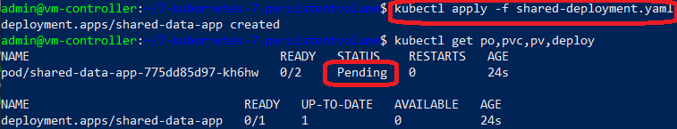

		<u>_Комментарии_</u>:

		> _Контейнеры создались, но находятся в статусе `Pending`, поскольку еще не создано хранилище (PersistentVolume)._

	2. Создание хранилища

		Команда:
		
		```
		kubectl apply -f local-pv.yaml
		```

		Результаты запуска:

		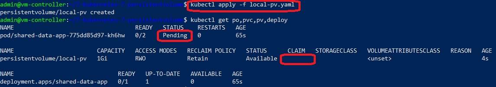

		<u>_Комментарии_</u>:

		> _Volume создался, но еще не примонтировался к контейнерам, посколоьку нет контроллера. Поэтому статус контейнеров и пода не поменялся - `Pending`._

	3. Создание контроллера хранилища

		Команда:
		
		```
		kubectl apply -f local-pvc.yaml
		```

		Результаты запуска:

		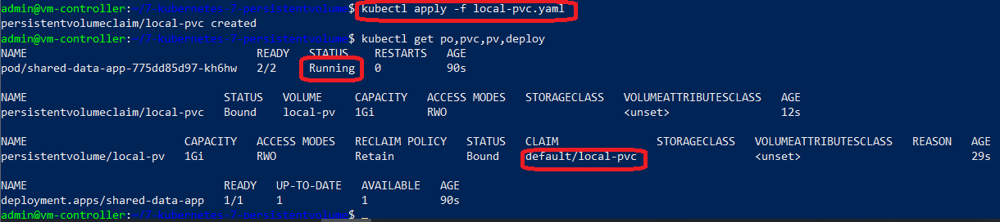

		<u>_Комментарии_</u>:

		> _Контроллер создался, примонтировал Volume к контейнерам пода, все контейнеры в поде запустились - `Running`._


	4. Анализ доступа изнутри контейнера `busybox`

		Команды:
		
		```
		kubectl exec -it shared-data-app-6bbcb5b84f-lblhm -c busybox -- sh
		ls -la /data
		cat /data/shared.txt
		```

		Результаты:

		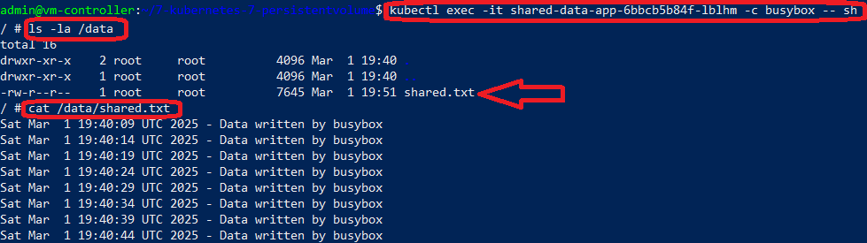

		<u>_Комментарии_</u>:

		> _Файл доступен внутри контейнера по пути `/data/shared.txt`._


	5. Анализ доступа изнутри контейнера `multitool`

		Команды:
		
		```
		kubectl exec -it shared-data-app-6bbcb5b84f-lblhm -c multitool -- sh
		ls -la /data
		cat /data/shared.txt
		```

		Результаты:

		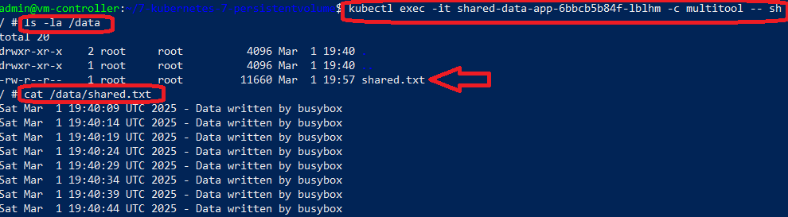

		<u>_Комментарии_</u>:

		> _Файл доступен внутри контейнера по пути `/data/shared.txt`._


	5. Анализ содержимого на узле кластера

		Команда (ssh к ВМ Cluster):
		
		```
		ls -la /mnt/data
		cat /mnt/data/shared.txt
		```

		Результаты:

		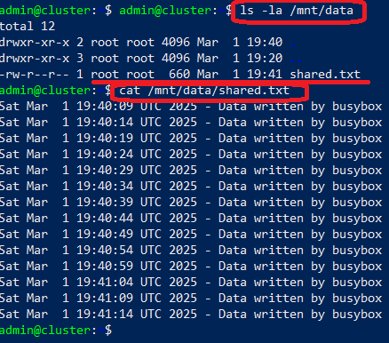

		<u>_Комментарии_</u>:

		> _На узле кластера (ноде) в локальной папке `/mnt/data/` создался файл `shared.txt`._


4. Удалить Deployment и PVC. Продемонстрировать, что после этого произошло с PV. Пояснить, почему.

	1. Удаление deployment
	
		Команда:

		```
		kubectl delete -f shared-deployment.yaml
		```

		Результат:

		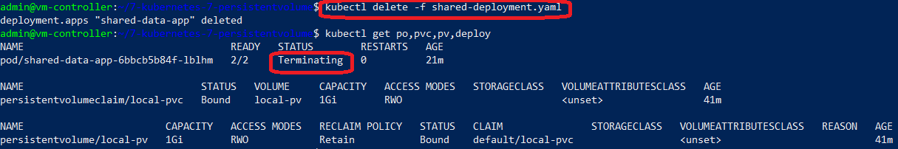

		<u>_Комментарии_</u>:

		> _Deployment удалился, но под и контейнеры остались в статусе `Terminating`. Они не могут быть физически удалены, пока к ним присоединён Volume._


	2. Удаление контроллера хранилища (PVC)
	
		Команда:

		```
		kubectl delete -f local-pvc.yaml
		```

		Результат:

		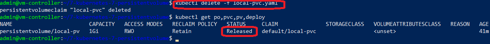

		<u>_Комментарии_</u>:

		> _Все контейнерыв и пода удалились. Само хранилище физически осталось, но получило статус `Released`. Оно будет доступно только после подключения его с помощью контроллера (PVC) к другим подам и контейнерам._

	3. Анализ содержимого хранилища на узле кластера

		Команда (ssh к ВМ Cluster):
		
		```
		ls -la /mnt/data
		```

		Результаты:

		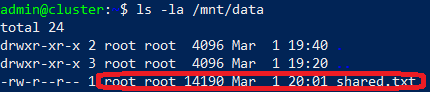

		<u>_Комментарии_</u>:

		> _Файл физически сохранился в локальной папке на ноде. При повторном запуске deployment - имеющиеся файлы будут доступны новым контейнерам и подам._


5. Удалить PV. Продемонстрировать что произошло с файлом после удаления PV. Пояснить, почему.

	1. Удаление хранилища (PV)
	
		Команда:

		```
		kubectl delete -f local-pv.yaml
		```

		Результат:

		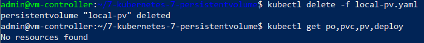

		<u>_Комментарии_</u>:

		> _Хранилище физически удалилось из имеющихся ресурсов кластера._


	2. Анализ содержимого хранилища на узле кластера

		Команда (ssh к ВМ Cluster):
		
		```
		ls -la /mnt/data
		```

		Результаты:

		

		<u>_Комментарии_</u>:

		> _Файл физически сохранился в локальной папке на ноде несмотря на удаление хранилища (PV). Это возможно благодаря тому, что Пбыл задан параметр `persistentVolumeReclaimPolicy: Retain`, который указывает на физическое сохранение всех файлов контейнера после его удаления из системы._


### Задание 2

1. Включить и настроить NFS-сервер на MicroK8S.

	Команда (ssh к ВМ Cluster):

	```
	microk8s enable hostpath-storage
	```
	
	Результат:

	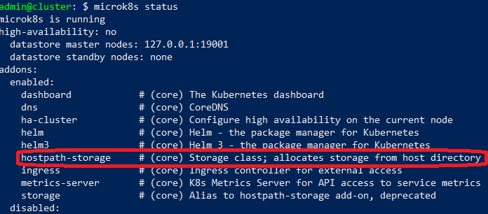

2. Создать Deployment приложения, которое может хранить файлы на NFS с динамическим созданием PV.

	1. Deployment _nfs-data-app_: файл - [nfs-deployment.yaml](nfs-deployment.yaml):
	
	- имя: `nfs-data-app`
	
	- количество реплик: `1`

	- фильтр на метки: `app: shared-data`

	- контейнеры: `multitool`

	- volume: `nfs-data-volume`
		- тип `persistentVolume`,

		- контроллер (PersistentVolumeClaim) `nfs-pvc`,

		- монтирован в папку `/data/` на контейнере

	2. Особенности контейнера:
	
		Контейнер `multitool` каждые 5 сек пишет в файл `/data/shared.txt` строку "$(date) - Data written by multitool"

		Исполняемый контейнером код (bash):
		```
		while true;
			do echo "$(date) - Data written by multitool" >> /data/shared.txt;
			sleep 5;
		done;
		```

	3. Особенности контроллера хранилища (PVC)
	
		- имя: `nfs-pvc`

		- тип: `storageClassName: "microk8s-hostpath"`

		- объем: 1Гб (`storage: 1Gi`)


	3. Создание deployment
		
		Команда:
		
		```
		kubectl apply -f nfs-deployment.yaml
		```

		Результаты запуска deployment:

		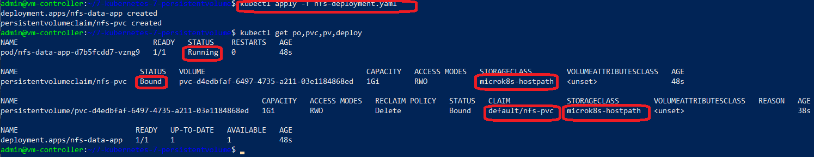

		<u>_Комментарии_</u>:

		> _Контейнеры создались, создался контроллер (PVC), а также автоматически создалось хранилище (volume), которое подмантировалось к контроллеру (статус `Bound`), что в свою очередь позволило сразу запустить контейнеры в поде (статус контейнера `Running`)._

3. Продемонстрировать возможность чтения и записи файла изнутри пода. 

	Доступ к монтированному хранилищу внутри контейнера `multitool` в поде.

	Команда:

	```
	kubectl exec -it nfs-data-app-d7b5fcdd7-vzng9 -c multitool -- sh
	ls -la /data
	cat /data/nfs-shared.txt
	```

	Результат:

	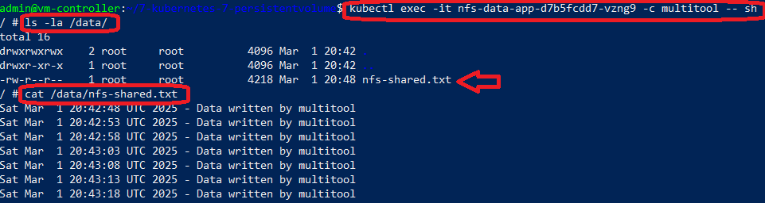

	<u>_Комментарии_</u>:

	> _Файл доступен внутри контейнера по пути `/data/nfs-shared.txt`._


## Инструменты и дополнительные материалы, которые пригодятся для выполнения задания

[Инструкция по установке NFS в MicroK8S](https://microk8s.io/docs/nfs). 

[Описание Persistent Volumes](https://kubernetes.io/docs/concepts/storage/persistent-volumes/). 

[Описание динамического провижининга](https://kubernetes.io/docs/concepts/storage/dynamic-provisioning/). 

[Описание Multitool](https://github.com/wbitt/Network-MultiTool).


# Задание

[https://github.com/netology-code/kuber-homeworks/blob/main/2.2/2.2.md](https://github.com/netology-code/kuber-homeworks/blob/main/2.2/2.2.md)
