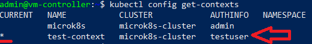
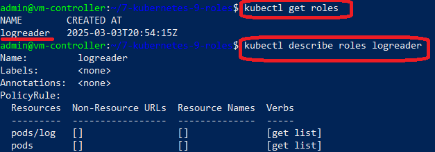
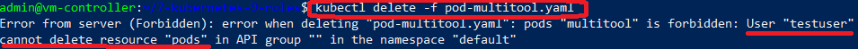

# УПРАВЛЕНИЕ ДОСТУПОМ В KUBERNETES. USER, SERVICEACCOUNT, ROLE, RBAC

## Стенд

Стенд состоит из двух виртуальных машин (ВМ) и хостовой машины:
1. Кластерная ВМ с установленным microk8s - **`cluster`** (Ubuntu 20) IP: **192.168.50.54**
	
	- дополнительно установлены расширения `dashboard`, `ingress`, `hostpath-storage`, `rbac`

2. ВМ управления с установленным kubectl - **`controller`** (Ubuntu 20) IP: **192.168.50.50**
3. Хостовой компьютер - **`host`** (Windows 10) IP: **192.168.50.1**

------

## Задания

### Задание 1. Создайте конфигурацию для подключения пользователя

1. Создайте и подпишите SSL-сертификат для подключения к кластеру.

	1. Предварительная подготовка

		Необходимо с узла кластера (`ВМ Cluster`) на управляющий узел (`ВМ Controller`) скопировать файлы корневого сертификата кластера:

		- `ca.crt` (сертификат)
		
		- `ca.key` (закрытый ключ) 
		
		- `ca.srl` (уникальный идентификатор сертификата)
	
		Все файлы копируются в папку `keys` на ВМ Controller.

	2. Создание закрытого ключа

		```
		openssl genrsa -out keys/testuser.key 2048
		```

		_Результат:_ файл `keys/testuser.key`.

	3. Создание запроса на подписание сертификата для сгенерированного закрытого ключа на имя пользователя `testuser`

		```
		openssl req -new -key keys/testuser.key -out keys/testuser.csr -subj "/CN=testuser"
		```

		_Результат:_ файл `keys/testuser.csr`.

	3. Подписание сертификата закрытым ключом кластера

		```
		openssl x509 -req -in keys/testuser.csr -CA keys/ca.crt -CAkey keys/ca.key -out keys/testuser.crt
		```

		_Результат:_ файл `keys/testuser.crt` - сертификат пользователя testuser, подписанный закрытым ключом кластера.


2. Настройте конфигурационный файл kubectl для подключения.

	1. Добавление параметров пользователя `testuser` в кластер

		```
		kubectl config set-credentials testuser --client-certificate=keys/testuser.crt --client-key=keys/testuser.key --embed-certs=true
		```
		
		_Результат:_ в файле `.kube/config` добавляется информация о новом пользователе - `testuser`
		
		

	2. Создание нового контекста `test-context`, в котором привязывается созданный пользователь к кластеру

		```
		kubectl config set-context test-context --cluster=microk8s-cluster --user=testuser
		```

		_Результат:_ созданный контекст с именем `test-context`.


	3. Выбор сновь созданного контекста как текущего

		```
		kubectl config use-context test-context
		```
		
		_Результат:_ текущим контекстом становится вновь созданный `test-context`.
		
		
		

3. Создайте роли и все необходимые настройки для пользователя.

	1. Описание роли - файл [logreader-role.yaml](logreader-role.yaml)

		- имя роли: `logreader`

		- объекты прменения роли: `pods, pods/log`

		- разрешённые операции: `get, list`

	2. Создание роли

		Команда:

		```
		kubectl apply -f logreader-role.yaml
		```

		_Результат:_ созданный объект типа "роль" с именем `logreader`.
		
		
		

	3. Привязка роли к пользователю - файл [logreader-rolebind.yaml](logreader-rolebind.yaml)

		- имя: `logreader-rolebind`

		- применение к пользователю: `name: testuser`

		- применение роли: `name: logreader`
	
		Команда:

		```
		kubectl apply -f logreader-rolebind.yaml
		```

		_Результат:_ созданный объект типа "RoleBind" с именем `logreader-rolebind`.
		
		


4. Проверка прав доступа роли

	1. Для проверки доступа к подам был создан тестовый под `multotool`([pod-multitool.yaml](pod-multitool.yaml))
	

	2. Получение списка подов

		Команда:

		```
		kubectl get po
		```

		Результат:

		

	3. Получение подробной информации о выбранном поде

		Команда:

		```
		kubectl describe po multitool
		```

		Результат:

		

	4. Получение журнала пода

		Команда:

		```
		kubectl logs multitool
		```

		Результат:

		

	5. Удаление пода

		Команда:

		```
		kubectl delete po multitool
		```

		Результат: _ошибка (нет прав у пользователя 'testuser')_

		


------

## Инструменты и дополнительные материалы, которые пригодятся для выполнения задания

[Описание RBAC](https://kubernetes.io/docs/reference/access-authn-authz/rbac/).

[Пользователи и авторизация RBAC в Kubernetes](https://habr.com/ru/company/flant/blog/470503/).

[RBAC with Kubernetes in Minikube](https://medium.com/@HoussemDellai/rbac-with-kubernetes-in-minikube-4deed658ea7b).

------

# Задание

[https://github.com/netology-code/kuber-homeworks/blob/main/2.4/2.4.md](https://github.com/netology-code/kuber-homeworks/blob/main/2.4/2.4.md)
