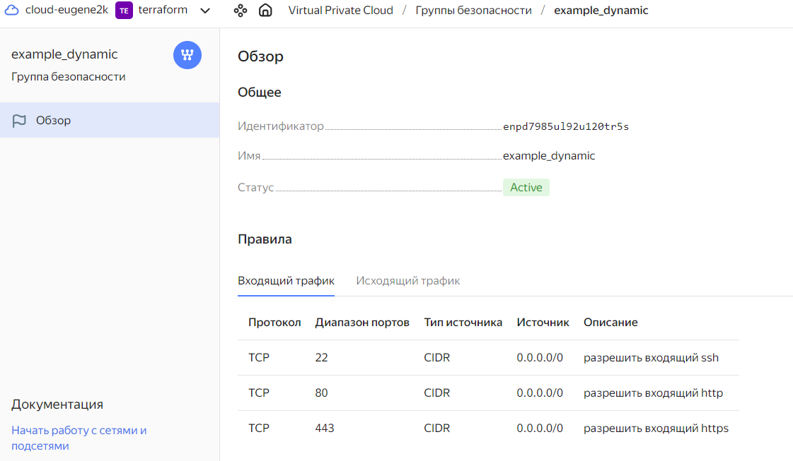

# УПРАВЛЯЮЩИЕ КОНСТРУКЦИИ В TERRAFORM

## Задание 1 - Инициализация проекта

В результате выполнения исходного кода были созданы:
- сеть `develop`
- подсеть `develop` с диапазоном адресов 10.0.1.0/24
- группа безопасности `example_dynamic` с правилами фильтрации входящего и исходящего трафика




## Задание 2 - Циклы

1. Создан файл [count-vm.tf](count-vm.tf). В нем описано создание двух __одинаковых__ ВМ `web-NN` с использованием `count`. Параметры ВМ заданы в переменной `var.vms_resources["web"]` ([variables.tf](variables.tf#L61)). 

2. Создан файл [for_each-vm.tf](for_each-vm.tf). В нем описано создание двух __разных__ ВМ `main` и '`replica` с использованием `for_each`. Параметры ВМ заданы в переменной `var.vms_resources` ([variables.tf](variables.tf#L72)). В блоке `locals` происходит поиск параметров ВМ по имени из словаря `var.vms_resources` с проверкой на существование указанных имен. В результате формируется список из имен ВМ, которые надо создать.

3. Добавлена зависимость: ВМ `web-NN` создаются _после_ ВМ `main` и `replica` ([count-vm.tf](count-vm.tf#L46)).

4. Добавлен файл с SSH-ключами (в папку проекта/.ssh). Настроено использование файла `id_ed25519.pub` для SSH-подключения (см. файл [locals.tf](locals.tf)).

5. Настроен вывод информации об IP-адресах созданных ВМ ([outputs.tf](outputs.tf)).


## Задание 3 - виртуальные диски

1. Создан файл [disk_vm.tf](disk_vm.tf), в котором описано создание __трех одинаковых__ дисков типа `yandex_compute_disk` с помощью `count`.


2. Создана ВМ `storage` с дисками из п.1. с использованием блока `dynamic` ([disk_vm.tf](disk_vm.tf#L40)).


## Задание 4 - Ansible

Создан файл [ansible.tf](ansible.tf). В нем вызывается шаблонизатор на основе файла [hosts.tftpl](hosts.tftpl). Параметры шаблона:
- `webservers` - список ВМ `web-NN`
- `databases` - список ВМ СУБД (`main`, `replica`)
- `storage` - список ВМ хранилища (`storage`)

В результате работы формируется файл [hosts.ini](hosts.ini)


## Задание 5* - Форматированный вывод

В файле [outputs.tf](outputs.tf) Реализованы циклы для вывода параметров _(extIP, intIP, ssh_string)_ созданных ВМ.


## Задание 6* - Ansible

_Выполню, когда изучим Ansible_.


## Задание 7* - Работа с массивами

Входные параметры
```
> local.vpc
{
  "network_id" = "enp7i560tb28nageq0cc"
  "subnet_ids" = [
    "e9b0le401619ngf4h68n",
    "e2lbar6u8b2ftd7f5hia",
    "b0ca48coorjjq93u36pl",
    "fl8ner8rjsio6rcpcf0h",
  ]
  "subnet_zones" = [
    "ru-central1-a",
    "ru-central1-b",
    "ru-central1-c",
    "ru-central1-d",
  ]
}
```
Вырезаем 3-й эоемент в массивах `vpc["subnet_ids"]` и `vpc["subnet_zones"]`
``` 
> concat(slice(local.vpc["subnet_ids"],0,2),slice(local.vpc["subnet_ids"],3,length(local.vpc["subnet_ids"])))
[
  "e9b0le401619ngf4h68n",
  "e2lbar6u8b2ftd7f5hia",
  "fl8ner8rjsio6rcpcf0h",
]

> concat(slice(local.vpc["subnet_zones"],0,2),slice(local.vpc["subnet_zones"],3,length(local.vpc["subnet_zones"])))
[
  "ru-central1-a",
  "ru-central1-b",
  "ru-central1-d",
]
>
```

## Задание 8 - Неверный шаблон

Шаблон с ошибками (исправленная версия - [hosts2.tftpl](hosts2.tftpl)):
```
[webservers]
%{~ for i in webservers ~}
${i["name"]} ansible_host=${i["network_interface"][0]["nat_ip_address"] platform_id=${i["platform_id "]}}
%{~ endfor ~}
```

Ошибки
1. Неверное расположение закрывающей фигурной скобки `...{i["platform_id "]}}` - её надо после `...[0]["nat_ip_address"]`

2. Неверный параметр элемента (ключ) `${i["platform_id "]}` - надо  `${i["platform_id"]}` _(без пробела)_


# Задание
[https://github.com/netology-code/ter-homeworks/blob/main/03/hw-03.md](https://github.com/netology-code/ter-homeworks/blob/main/03/hw-03.md)
