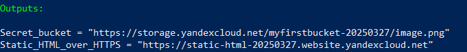
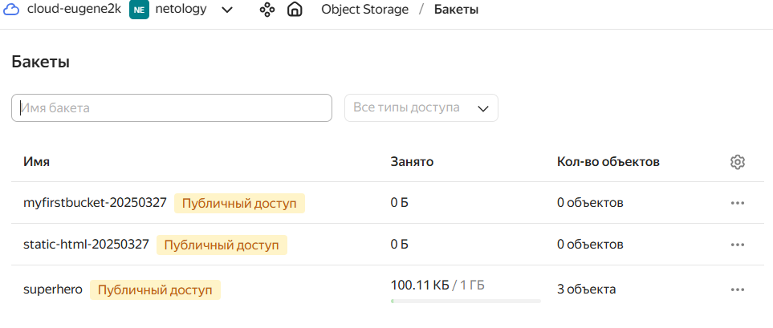
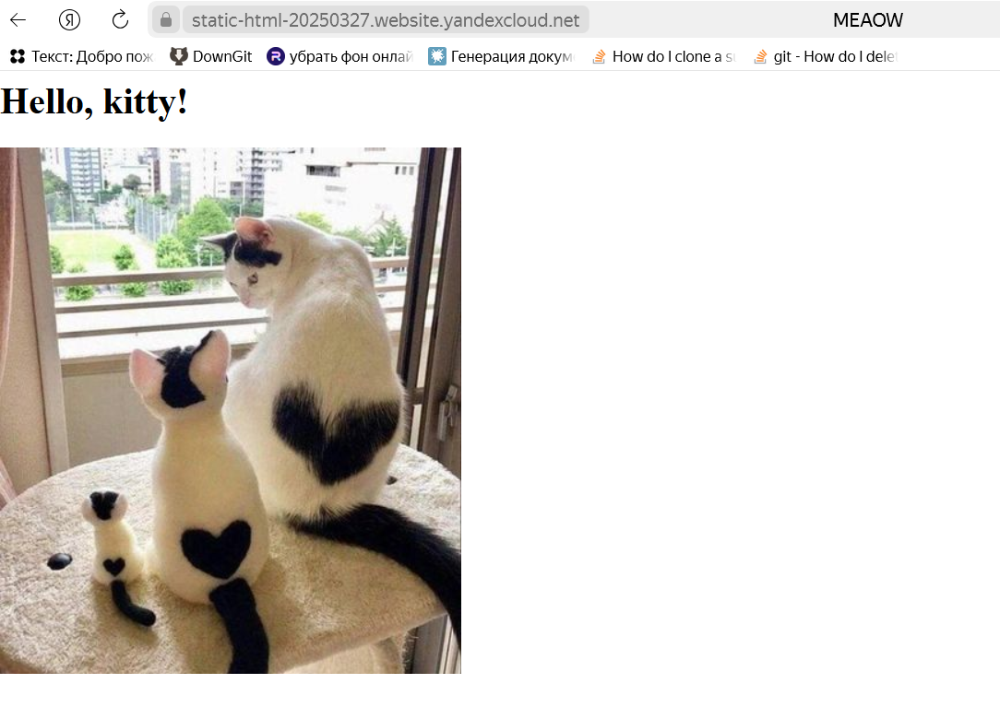

# БЕЗОПАСНОСТЬ В ОБЛАЧНЫХ ПРОВАЙДЕРАХ

Используя конфигурации, выполненные в рамках предыдущих домашних заданий, нужно добавить возможность шифрования бакета.

------

## Задание 1. Yandex Cloud   

1. С помощью ключа в KMS необходимо зашифровать содержимое бакета:

 - создать ключ в KMS;
 - с помощью ключа зашифровать содержимое бакета, созданного ранее.
2. (Выполняется не в Terraform)* Создать статический сайт в Object Storage c собственным публичным адресом и сделать доступным по HTTPS:

 - создать сертификат;
 - создать статическую страницу в Object Storage и применить сертификат HTTPS;
 - в качестве результата предоставить скриншот на страницу с сертификатом в заголовке (замочек).

__Результаты:__

1. Структура проекта:
    
    [terraform/variables.tf](terraform/variables.tf) - используемые переменные

    [terraform/variables.auto.tfvars](terraform/variables.auto.tfvars) - подставляемые переменные

    [terraform/main.tf](terraform/main.tf) - основной файл с описанием всех ресурсов

    [terraform/outputs.tf](terraform/outputs.tf) - выводимый на экран результат после создания всех ресурсов
    
    [data](data/) - папка с данными, загружаемыми в Object Storage


2. Создание инфраструктуры

    1. Создание файлов сертификата (.crt) и ключа (.key) для домена `example.com`

		  ```
		  openssl req -x509 -nodes -newkey rsa:2048 -keyout keys/tls.key -out keys/tls.crt -subj "/CN=example.com/O=example.com"
    	```

		  _Результат:_ в папке `keys` создаются файлы `keys/tls.key` и `keys/tls.crt`.


    2. Копирование содержимого ключей в переменные `cert_certificate` и `cert_private_key` ([terraform/variables.tf](terraform/variables.tf#L106))
      
        _Как правило, это делают в файле `secret.auto.tfvars`._


    3. Создание инфраструктуры
    
        Команда:
        ```
        terraform -chdir=./terraform apply
        ```

        Результат:

        


        Созданные объекты:

        


    4. Проверка доступа по HTTPS к static-web
    
        


------

## Задание 2*. AWS (задание со звёздочкой)

Это необязательное задание. Его выполнение не влияет на получение зачёта по домашней работе.

**Что нужно сделать**

1. С помощью роли IAM записать файлы ЕС2 в S3-бакет:
 - создать роль в IAM для возможности записи в S3 бакет;
 - применить роль к ЕС2-инстансу;
 - с помощью bootstrap-скрипта записать в бакет файл веб-страницы.
2. Организация шифрования содержимого S3-бакета:

 - используя конфигурации, выполненные в домашнем задании из предыдущего занятия, добавить к созданному ранее бакету S3 возможность шифрования Server-Side, используя общий ключ;
 - включить шифрование SSE-S3 бакету S3 для шифрования всех вновь добавляемых объектов в этот бакет.

3. *Создание сертификата SSL и применение его к ALB:

 - создать сертификат с подтверждением по email;
 - сделать запись в Route53 на собственный поддомен, указав адрес LB;
 - применить к HTTPS-запросам на LB созданный ранее сертификат.


Пример bootstrap-скрипта:

```
#!/bin/bash
yum install httpd -y
service httpd start
chkconfig httpd on
cd /var/www/html
echo "<html><h1>My cool web-server</h1></html>" > index.html
aws s3 mb s3://mysuperbacketname2021
aws s3 cp index.html s3://mysuperbacketname2021
```

------

## Инструменты и дополнительные материалы, которые пригодятся для выполнения задания

1. Yandex.Cloud

  - [Настройка HTTPS статичного сайта](https://cloud.yandex.ru/docs/storage/operations/hosting/certificate)
  - [Object Storage bucket](https://registry.terraform.io/providers/yandex-cloud/yandex/latest/docs/resources/storage_bucket)
  - [KMS key](https://registry.terraform.io/providers/yandex-cloud/yandex/latest/docs/resources/kms_symmetric_key)

2. AWS

  - [IAM Role](https://registry.terraform.io/providers/hashicorp/aws/latest/docs/resources/iam_role).
  - [AWS KMS](https://registry.terraform.io/providers/hashicorp/aws/latest/docs/resources/kms_key).
  - [S3 encrypt with KMS key](https://registry.terraform.io/providers/hashicorp/aws/latest/docs/resources/s3_bucket_object#encrypting-with-kms-key).


------ 

# Задание

[https://github.com/netology-code/clopro-homeworks/blob/main/15.3.md](https://github.com/netology-code/clopro-homeworks/blob/main/15.3.md)
