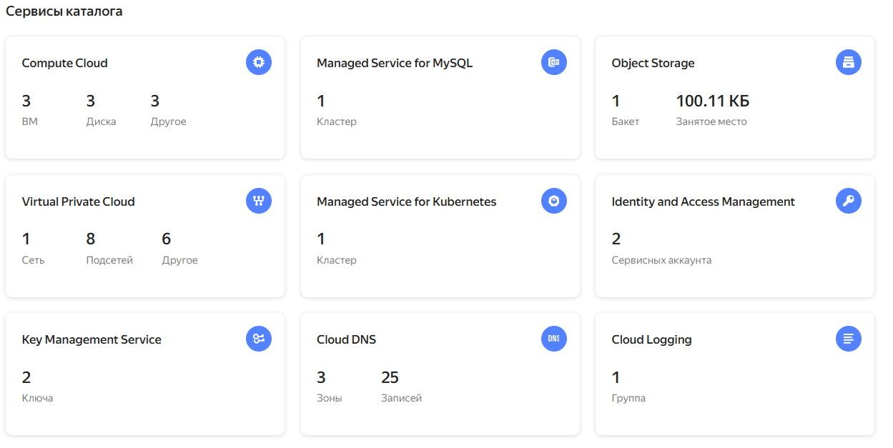

# КЛАСТЕРЫ. РЕСУРСЫ ПОД УПРАВЛЕНИЕМ ОБЛАЧНЫХ ПРОВАЙДЕРОВ (на примере Yandex.Cloud)

## Задание 1. Yandex Cloud   

1. Настроить с помощью Terraform кластер баз данных MySQL.

 - Используя настройки VPC из предыдущих домашних заданий, добавить дополнительно подсеть private в разных зонах, чтобы обеспечить отказоустойчивость. 
 - Разместить ноды кластера MySQL в разных подсетях.
 - Необходимо предусмотреть репликацию с произвольным временем технического обслуживания.
 - Использовать окружение Prestable, платформу Intel Broadwell с производительностью 50% CPU и размером диска 20 Гб.
 - Задать время начала резервного копирования — 23:59.
 - Включить защиту кластера от непреднамеренного удаления.
 - Создать БД с именем `netology_db`, логином и паролем.

2. Настроить с помощью Terraform кластер Kubernetes.

 - Используя настройки VPC из предыдущих домашних заданий, добавить дополнительно две подсети public в разных зонах, чтобы обеспечить отказоустойчивость.
 - Создать отдельный сервис-аккаунт с необходимыми правами. 
 - Создать региональный мастер Kubernetes с размещением нод в трёх разных подсетях.
 - Добавить возможность шифрования ключом из KMS, созданным в предыдущем домашнем задании.
 - Создать группу узлов, состояющую из трёх машин с автомасштабированием до шести.
 - Подключиться к кластеру с помощью `kubectl`.
 - *Запустить микросервис phpmyadmin и подключиться к ранее созданной БД.
 - *Создать сервис-типы Load Balancer и подключиться к phpmyadmin. Предоставить скриншот с публичным адресом и подключением к БД.


__Результаты:__

1. Структура проекта
    
    - [terraform/variables.tf](terraform/variables.tf) - используемые переменные

    - [terraform/variables.auto.tfvars](terraform/variables.auto.tfvars) - подставляемые переменные

    - [terraform/main.tf](terraform/main.tf) - основной файл с описанием всех ресурсов

    - [terraform/outputs.tf](terraform/outputs.tf) - выводимый на экран результат после создания всех ресурсов

    В файле [terraform/main.tf](terraform/main.tf) описаны следующие типы ресурсов _(имена и параметры всех объектов задаются в переменных [terraform/variables.auto.tfvars](terraform/variables.auto.tfvars))_:

      1. Основные сетевые ресурсы
      
          - сеть `vpc`

          - 3 подсети [`public`](terraform/main.tf#L10) в разных зонах доступности: `["192.168.11.0/24", "192.168.12.0/24", "192.168.13.0/24"]`
          
          - 3 подсети [`private`](terraform/main.tf#L21) в разных зонах доступности: `["192.168.201.0/24", "192.168.202.0/24", "192.168.203.0/24"]`

      2. Кластер MySQL
      
          - группа безопасности для задания правил сетевого трафика [`mysql_sg`](terraform/main.tf#L34)
          
          - сам кластер [`mysql_cluster`](terraform/main.tf#L51) в подсети `private` с именем `mysql-cluster`
          
          - БД [`mysql_db`](terraform/main.tf#L92) с именем `netology_db`
          
          - пользователь БД [`mysql_user`](terraform/main.tf#L97) с именем `user` и паролем

      3. Региональный кластер Kubernetes

          - сервисный аккаунт Yandex для управления кластером [`k8s_sa`](terraform/main.tf#L113) с именем `k8s-service-account` и назначенными ролями `editor`, `k8s.clusters.agent`, `vpc.publicAdmin`, `container-registry.images.puller`, `kms.keys.encrypterDecrypter`

          - ключ Yandex Key Management Service [`kms-key`](terraform/main.tf#L153)

          - группа безопасности для задания правил сетевого трафика кластера [`k8s_sg`](terraform/main.tf#L168)
          
          - сам кластер [`regional_cluster`](terraform/main.tf#L214) с именем `k8s-regional-cluster` с 3-мя мастерами во всех зонах доступности в подсетях `public`

          - 3 группы узлов [`node_group`](terraform/main.tf#L261) в каждой зоне доступности с 1 узлом и динамическим масштабированием до 2-х узлов в каждой группе

      4. Настройка kubectl

          - создание конфигурационного файла [`kubeconfig`](terraform/main.tf#L315) с именем `kubeconfig.yaml` на основе шаблона [kubernetes/kubeconfig.tpl](kubernetes/kubeconfig.tpl)

      5. Сервис _phpmyadmin_

          - deployment - структура приложения [`phpmyadmin`](terraform/main.tf#L333)

          - сервис приложения [`phpmyadmin`](terraform/main.tf#L381) типа `"LoadBalancer"`


2. Создание инфраструктуры

    Команда:
    ```
    terraform -chdir=./terraform apply
    ```

    Результат:

    


    Созданные объекты:

    

    Подсети private и public:

    
    
    Сервисный аккаунт:

    

    MySQL-кластер:

    

    Kuberneytes-кластер:

    

    Группы узлов в кластере:

    


3. Подключение к Kubernetes-кластеру

    1. Добавление контекста нового кластера

        ```
        yc managed-kubernetes cluster get-credentials --name k8s-regional-cluster --internal
        ```
    
    2. Просмотр доступных контекстов и выбор контекста по умолчанию

        ```
        kubectl config get-contexts
        kubectl config use-context yc-k8s-regional-cluster
        ```

        


      


------

## Задание 2*. Вариант с AWS (задание со звёздочкой)

Это необязательное задание. Его выполнение не влияет на получение зачёта по домашней работе.

**Что нужно сделать**

1. Настроить с помощью Terraform кластер EKS в три AZ региона, а также RDS на базе MySQL с поддержкой MultiAZ для репликации и создать два readreplica для работы.
 
 - Создать кластер RDS на базе MySQL.
 - Разместить в Private subnet и обеспечить доступ из public сети c помощью security group.
 - Настроить backup в семь дней и MultiAZ для обеспечения отказоустойчивости.
 - Настроить Read prelica в количестве двух штук на два AZ.

2. Создать кластер EKS на базе EC2.

 - С помощью Terraform установить кластер EKS на трёх EC2-инстансах в VPC в public сети.
 - Обеспечить доступ до БД RDS в private сети.
 - С помощью kubectl установить и запустить контейнер с phpmyadmin (образ взять из docker hub) и проверить подключение к БД RDS.
 - Подключить ELB (на выбор) к приложению, предоставить скрин.

------

## Инструменты и дополнительные материалы, которые пригодятся для выполнения задания

1. Yandex.Cloud

  - [MySQL cluster](https://registry.terraform.io/providers/yandex-cloud/yandex/latest/docs/resources/mdb_mysql_cluster).
  - [Создание кластера Kubernetes](https://cloud.yandex.ru/docs/managed-kubernetes/operations/kubernetes-cluster/kubernetes-cluster-create)
  - [K8S Cluster](https://registry.terraform.io/providers/yandex-cloud/yandex/latest/docs/resources/kubernetes_cluster).
  - [K8S node group](https://registry.terraform.io/providers/yandex-cloud/yandex/latest/docs/resources/kubernetes_node_group).
  - [Модуль EKS](https://learn.hashicorp.com/tutorials/terraform/eks).


2. AWS

  - [Модуль EKS](https://learn.hashicorp.com/tutorials/terraform/eks).


------ 

# Задание

[https://github.com/netology-code/clopro-homeworks/blob/main/15.4.md](https://github.com/netology-code/clopro-homeworks/blob/main/15.4.md)
